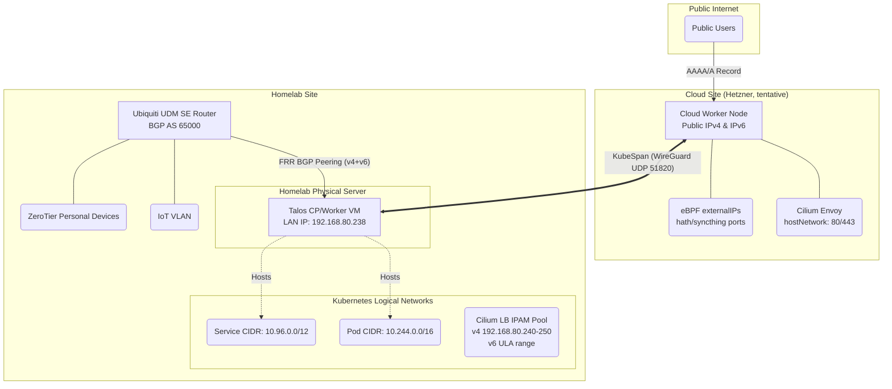

# Next-Generation Hybrid Kubernetes Cluster Architecture

Objective: Deploy a high-performance hybrid Kubernetes cluster spanning a
cloud VPS and a Homelab LAN. Ensure low stack complexity, minimal vendor
lock-in, and declarative management using Pulumi.

> **Status**: This is the canonical architecture document. The plan moved
> from AWS to GCP in April 2026 (commit `487ebd4`); the 2026-08-21
> detailed-design review then tentatively replaced GCP with **Hetzner Cloud**
> on measured egress economics (see [nodes.md](nodes.md) §2–3, and §6.3
> below) and settled the ingress/egress/LB/DNS design in §3. "Cloud node"
> below means the Hetzner instance unless stated otherwise. The code in
> `src/kluster/physical/aws.py` predates all of this and will be replaced
> during implementation.

## 1. Architecture Overview

### 1.1 High-Level Design

-   **Control Plane**: Single-node powerful VM in the Homelab. Avoids
    WAN-latency penalties on etcd.
-   **Worker Nodes**: one cloud instance (tentatively Hetzner CPX21,
    Ashburn) handles public ingress and stable-IP workloads (hath); the
    Homelab VM handles internal workloads and bulk-egress workloads.
-   **OS**: Talos Linux (Immutable, API-driven).
-   **Transport / Underlay**: Talos KubeSpan (WireGuard mesh) for encrypted
    node-to-node communication across the public internet.
-   **CNI & Routing**: Cilium (eBPF-based, bypassing kube-proxy and iptables).
-   **Ingress (Cloud, HTTP/S)**: Cilium Gateway API (Envoy) running in
    hostNetwork mode.
-   **Ingress (Cloud, raw TCP/UDP)**: Cilium eBPF service exposure
    (`externalIPs` / hostPort) — no extra proxy (§3.2).
-   **Ingress (LAN)**: Cilium LB IPAM + BGP Peering with Ubiquiti UDM SE,
    dual-stack (IPv4 + ULA IPv6).
-   **Egress**: default per-node local egress; bulk egress stays on the home
    uplink; Cilium Egress Gateway available for stable-IP steering (§3.4).

### 1.2 Network Topology



### 1.3 IP Stack Architecture: Dual-Stack (IPv4 Primary)

The cluster will operate in Dual-Stack mode, prioritizing IPv4.

-   **Why not IPv6-only?** Many legacy apps hardcode 0.0.0.0, and crucial
    container registries like ghcr.io do not support IPv6.
-   **Talos Configuration Rule**: You must define the IPv4 CIDRs first in the
    machine.network arrays to establish IPv4 as the primary family,
    preventing subtle ecosystem bugs.
-   **LAN IPv6 uses ULA**: the home GUA prefix is not stable, so the LAN LB
    pool's v6 addresses come from a dedicated ULA range (exact range chosen
    at implementation; avoid the UDM `::` anycast trap — always `::1`-style
    host addresses). Known consequence: RFC 6724 source/destination
    selection makes clients prefer IPv4 when the AAAA is ULA — v6 on the LAN
    is architecture-complete but rarely chosen by clients until a stable GUA
    prefix exists.

## 2. Core Infrastructure Components

### 2.1 Talos Linux Features ([Docs](https://www.talos.dev/))

-   **KubeSpan**: Native WireGuard mesh. Handles NAT traversal automatically
    because the cloud node has a public IP, allowing the Homelab node to
    initiate the connection.
-   **KubePrism**: A local HAProxy load balancer running on every node
    (localhost:7445). All worker nodes and internal components point to this
    instead of a hardcoded external API IP.

### 2.2 Cilium eBPF CNI ([Docs](https://docs.cilium.io/))

-   **Kube-Proxy Replacement**: kube-proxy is disabled in Talos. Cilium
    handles all L3/L4 routing directly in the kernel using eBPF, eliminating
    iptables bottlenecks.
-   **Bootstrap Requirement**: Because kube-proxy is disabled, the Cilium
    Helm chart must explicitly point to KubePrism (k8sServiceHost: localhost,
    k8sServicePort: 7445) to reach the API server on startup.

## 3. Ingress, Egress & Load Balancing

### 3.1 Cloud Ingress (HTTP/S): Gateway API + HostNetwork

In cloud VPCs, L2 announcements and arbitrary BGP IP broadcasts are blocked.

-   **Implementation**: Enable Cilium Gateway API with hostNetwork: true.
    Cilium deploys Envoy directly to the cloud node's host interfaces
    (ports 80/443).
-   **Load Balancing**: Use standard A/AAAA DNS records pointing directly to
    the cloud node's public IPs. eBPF routes traffic from Envoy to the
    correct internal pods.

### 3.2 Cloud Ingress (raw TCP/UDP): eBPF service exposure

Public non-HTTP ports (hath, syncthing 22000/tcp+udp, etc.) are exposed
without any additional proxy: a normal `Service` carrying
`externalIPs: [<cloud node public IPs>]` (or hostPort on the pod). Cilium's
kube-proxy replacement DNATs these in-kernel on the node — zero extra
components, zero extra hops. Provider firewall opens exactly these ports.

Gateway API TCPRoute/UDPRoute (added in Cilium 1.20) was considered and
rejected: it is incompatible with hostNetwork gateways, and routing raw TCP
through Envoy adds a proxy hop that buys nothing for these protocols.

### 3.3 LAN Ingress: Cilium IPAM + BGP Peering (dual-stack)

To expose services to the Homelab LAN without port conflicts (avoiding k3s
ServiceLB limitations):

1.  **IPAM Pool**: A CiliumLoadBalancerIPPool with a dedicated IPv4 range
    (192.168.80.240-250) **and** a ULA IPv6 range (§1.3).
2.  **Assignment**: When an internal app requests a type: LoadBalancer
    Service, Cilium assigns it an IP (or one per family) from this pool.
3.  **BGP Announcement**: A CiliumBGPPeeringPolicy establishes a BGP session
    with the UDM SE over both address families, advertising the Service IPs
    as /32 + /128. LAN and ZeroTier devices route to them natively without
    NAT (the UDM must route the ZT subnet to the LB pool).
4.  **Split-horizon DNS**: AdGuard (alice/bob) rewrites public hostnames to
    LAN LB IPs so LAN/ZT clients reach apps (immich!) directly, never via
    the cloud path — this preserves the legacy cluster's hard-earned rule
    that LAN access to immich must not traverse the VPS.

### 3.4 Egress Design

-   **Default**: pods egress via their own node (cloud node → cloud IP,
    homelab → home uplink).
-   **Bulk egress (qbittorrent, seeding, large syncs)**: pinned to the
    homelab pool; leaves via the home uplink. Never routed through a
    metered-egress cloud path.
-   **Stable-IP workloads (hath)**: hath requires its inbound port and
    outbound connections on the same stable public IP. Preferred placement:
    **run hath on the cloud node itself** (cache on local disk; in/out are
    naturally the same IP; no steering machinery at all). Fallback if its
    storage outgrows the cloud disk: keep hath in the homelab and steer its
    egress through a **Cilium Egress Gateway** policy via the cloud node
    (SNAT to the cloud IP over KubeSpan) — this replaces the legacy
    hand-rolled WireGuard-gateway-pod + initContainer-route hack entirely.
    Egress Gateway IPv4 is mature; verify v6 support at implementation if
    ever needed (hath is v4).

### 3.5 Workload Routing Decision Matrix

When deploying an application, use the following rules:

-   Public HTTP/S Apps (e.g., blogs, authelia, splitpro): Gateway API
    HTTPRoute (§3.1).
-   Public TCP/UDP Apps (e.g., syncthing, hath port): Service with
    `externalIPs` on the cloud node (§3.2).
-   Internal LAN Apps (e.g., Jellyfin, immich fast path): type: LoadBalancer
    Service from the dual-stack pool + split-horizon DNS (§3.3).
-   Bulk-egress workloads (qbittorrent): homelab pool, home uplink (§3.4).
-   Stable-IP workloads (hath): cloud node, same-IP in/out (§3.4).

## 4. Security & Observability

### 4.1 Threat Model: KubeSpan vs mTLS

-   **Transport Security**: KubeSpan encrypts all inter-node traffic
    traversing the public internet via WireGuard.
-   **Node Compromise**: If a Talos node is compromised, the attacker has
    kernel access; mTLS certificates would be compromised anyway. Talos's
    immutable, API-only architecture mitigates this.
-   **Pod Compromise**: mTLS does not prevent a compromised pod from using
    its legitimate access. Therefore, we use Cilium Network Policies (eBPF
    L3/L4/L7 rules) to strictly isolate namespaces and pods, which is
    superior to complex sidecar-based mTLS.

### 4.2 L7 Observability (Hubble)

By enabling Hubble within Cilium, the eBPF datapath and Envoy proxies provide
deep observability into HTTP paths, gRPC codes, and DNS queries without
requiring application modification.

## 5. Infrastructure as Code (Pulumi Implementation)

The entire stack is deployed via Pulumi using multiple providers:

### 5.1 Infrastructure Provisioning

1.  **Libvirt (pulumi-libvirt)**: Provisions the Talos VM on the Homelab
    physical server (passing through NIC/macvlan). Outputs the dynamically
    assigned local IP.
2.  **Hetzner Cloud (pulumi-hcloud, tentative)**: Provisions the cloud
    instance (Talos via ISO/snapshot image), dual-stack primary IPs, and
    firewall rules.
    -   Required Firewall Rules: 80, 443 (Ingress), 51820 UDP
        (WireGuard/KubeSpan), plus the raw TCP/UDP service ports (§3.2).
3.  **UniFi (pulumiverse/unifi)**: Configures port forwarding on the DMSE to
    allow the cloud node (and CI) to reach the Homelab Control Plane.
    -   Required Ports: 6443 (Kube API), 50000 (Talos API). Both are
        mTLS-authenticated; optionally restrict sources to the cloud node
        and CI egress IPs. Human remote administration does not use these:
        personal devices reach the API over ZeroTier via the UDM.
4.  **Cloudflare (pulumi-cloudflare)**: **all** public DNS records move into
    Pulumi. The standalone DNSControl repo
    ([Aetf/dns](https://github.com/Aetf/dns), `dnsconfig.js`) is absorbed
    and retired — one declarative world, previewable diffs. (in-cluster
    external-dns rejected, §6.4.)
5.  **Backblaze B2 (bridged provider)**: the backup bucket + keys +
    lifecycle rules (see [storage.md](storage.md) §4).

### 5.2 BGP Router Configuration (Semi-Automated)

Because the unifi provider does not currently support BGP APIs, Pulumi will
use the pulumi-local provider to dynamically generate the required FRR
configuration file based on the libvirt VM's state.

-   **Action**: Take the Pulumi-generated .conf file and manually upload it
    via the UDM SE web interface.

Generated FRR Template Example (both address families):

```text
router bgp 65000  
 neighbor {Homelab_VM_IP} remote-as 65000  
 neighbor {Homelab_VM_IP} update-source br0  
address-family ipv4 unicast  
 neighbor {Homelab_VM_IP} activate  
exit-address-family  
address-family ipv6 unicast  
 neighbor {Homelab_VM_IP} activate  
exit-address-family  
```

## 6. Alternatives Considered

§6.1–6.2 were evaluated during the earlier AWS iteration of this plan; the
reasoning is provider-agnostic and carried over unchanged. §6.3–6.6 were
settled in the 2026-08-21 detailed-design review.

### 6.1 IPv6-Only VPC + NAT64

-   **The Idea**: Use an IPv6-only VPC to avoid the monthly public IPv4
    address charge, relying on public DNS64/NAT64 (e.g., nat64.net) or a
    cloud-managed NAT gateway for IPv4-only destinations.
-   **Why it was rejected**:
    1.  **Cost Trap**: Cloud-managed NAT gateways cost ~$32/mo minimum, far
        exceeding the cost of a single static IPv4 address.
    2.  **CLAT Limitations**: Apps that hardcode IPv4 (0.0.0.0, 1.1.1.1) fail
        entirely in IPv6-only environments without complex CLAT translation on
        the node.
    3.  **Stability**: Relying on free, third-party NAT64 introduces a massive
        single point of failure for pulling containers from legacy registries
        like ghcr.io.

### 6.2 Three-Node HA Control Plane (1 Home, 2 Cloud)

-   **The Idea**: Distribute control plane nodes across the Homelab and the
    cloud for high availability.
-   **Why it was rejected**: etcd requires low-latency Raft consensus.
    Stretching it over a WAN adds 15ms-50ms+ latency to every API write,
    starving the cluster. Additionally, "tiny" cloud VMs are prone to OOM
    kills running etcd. A single, powerful Homelab node with S3 backups is
    significantly faster and more stable.

### 6.3 GCP (or AWS) as the Cloud Site

-   **The Idea**: the April 2026 plan; Compute Engine e2-medium as the
    cloud worker.
-   **Why it was demoted** (2026-08-21, tentative pending a final
    total-cost check): measured steady-state public egress is
    ~150–220 GB/mo (legacy traefik ~96 GB TX/30d + hath ~50–110 GB/mo;
    the August spike was one-off migration traffic). On GCP, dual-stack
    forces Premium-tier networking (external IPv6 is Premium-only), so
    egress is $0.12/GB from the 2nd GiB: ~$42–50/mo total vs ~$33 on AWS
    (100 GB free) vs ~$14 flat on Hetzner CPX21 with 1 TB included — which
    also absorbs KubeSpan inter-node traffic for free. No managed cloud
    service is consumed by this architecture, so the hyperscaler premium
    buys nothing. Revisit only if Hetzner proves operationally inadequate.

### 6.4 In-cluster external-dns

-   Rejected in favor of all DNS records living in Pulumi: same declarative
    world as every other resource, previewable and reviewable diffs. The
    cost — new public apps require a Pulumi change — is acceptable since app
    deployment is a Pulumi change anyway.

### 6.5 Cloud-Hosted or Free-Tier Control Plane

-   **The Idea** (revisited 2026-08-21): move the control plane off the
    Homelab — either combined onto the Hetzner worker (upsized), a
    dedicated small cloud instance, or 3× Oracle Always-Free ARM VMs as a
    same-region HA control plane (which, unlike §6.2, would not stretch
    etcd across a WAN).
-   **Why it was rejected**: a control-plane outage does not stop running
    workloads (kubelet, Cilium datapath, and Envoy keep working; only
    scheduling/config changes stop), and the cluster's data gravity is in
    the Homelab — when the home site is down, a surviving API has almost
    nothing useful to manage. Against that narrow benefit: a cloud CP costs
    real money and/or co-locates etcd (all cluster secrets) with the
    public attack surface; GCP's free e2-micro (1 GB) is exactly the
    OOM-prone tiny-VM etcd host §6.2 warns about; Oracle's free tier is
    spec-sufficient but adds a third site + provider and entrusts etcd to a
    reclaimable free tenancy. Note also that remote *management* needs no
    cloud CP in normal operation: personal devices reach the Homelab API
    over ZeroTier (via the UDM), so kubectl/talosctl work from anywhere
    while the home uplink is up — the cloud-CP benefit shrinks to the
    full-home-outage case only. Instead, the Homelab CP is backstopped by a
    **drilled cold-standby path**: re-bootstrap a temporary CP from the
    hourly etcd snapshot (e.g., on the cloud node) in ~30–60 min during an
    extended home outage (nodes.md §5 Tier 0).

### 6.6 Gateway API TCPRoute/UDPRoute for raw TCP/UDP

-   Rejected: see §3.2. Available only from Cilium 1.20, incompatible with
    hostNetwork gateways, and an unnecessary proxy hop for hath/syncthing
    class traffic. eBPF `externalIPs` exposure does the job with zero
    components.
