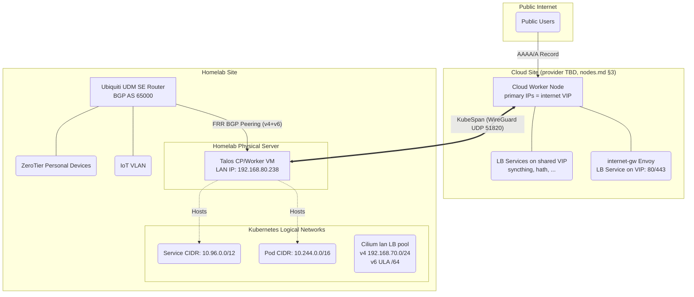

# Next-Generation Hybrid Kubernetes Cluster Architecture

Objective: Deploy a high-performance hybrid Kubernetes cluster spanning a
cloud VPS and a Homelab LAN. Ensure low stack complexity, minimal vendor
lock-in, and declarative management using Pulumi.

> **Status**: This is the canonical architecture document. The plan moved
> from AWS to GCP in April 2026 (commit `487ebd4`); the 2026-08-21 review
> tentatively picked Hetzner, which the 2026-06-15 Hetzner US price hike
> then voided — **cloud provider selection is reopened** and argued in
> [nodes.md](nodes.md) §3; this document is provider-agnostic ("cloud
> node" = whichever instance nodes.md lands on). The 2026-08-22 iteration
> unified ingress into the two-pool LoadBalancer model (§3), automated the
> UDM side (§5.2), and adopted HAOS into the physical layer (§5.1, §6.8).
> The code in `src/kluster/physical/aws.py` predates all of this and will
> be replaced during implementation.

## 1. Architecture Overview

### 1.1 High-Level Design

-   **Control Plane**: Single-node powerful VM in the Homelab. Avoids
    WAN-latency penalties on etcd.
-   **Worker Nodes**: one cloud instance (provider selection reopened —
    nodes.md §3) handles public ingress and stable-IP workloads (hath);
    the Homelab VM handles internal workloads and bulk-egress workloads.
-   **OS**: Talos Linux (Immutable, API-driven).
-   **Transport / Underlay**: Talos KubeSpan (WireGuard mesh) for encrypted
    node-to-node communication across the public internet.
-   **CNI & Routing**: Cilium (eBPF-based, bypassing kube-proxy and iptables).
-   **Ingress (both sides, unified)**: every exposed app is a
    `type: LoadBalancer` Service drawing from one of two Cilium LB IPAM
    pools — `internet` (routed public IPs on the cloud node) or `lan`
    (dedicated dual-stack subnet BGP-announced to the UDM SE). HTTP/S goes
    through Cilium Gateway API (Envoy) gateways that are themselves
    LoadBalancer Services from these pools (§3).
-   **Egress**: default per-node local egress; bulk egress stays on the home
    uplink; Cilium Egress Gateway available for stable-IP steering (§3.5).

### 1.2 Network Topology

### 1.3 IP Stack Architecture: Dual-Stack (IPv4 Primary)

The cluster will operate in Dual-Stack mode, prioritizing IPv4.

-   **Why not IPv6-only?** Many legacy apps hardcode 0.0.0.0, and crucial
    container registries like ghcr.io do not support IPv6.
-   **Talos Configuration Rule**: You must define the IPv4 CIDRs first in the
    machine.network arrays to establish IPv4 as the primary family,
    preventing subtle ecosystem bugs.
-   **LAN IPv6 uses ULA**: the home GUA prefix is not stable, so the LAN LB
    pool's v6 addresses come from a dedicated ULA range (exact range chosen
    at implementation; avoid the UDM `::` anycast trap — always `::1`-style
    host addresses). Known consequence: RFC 6724 source/destination
    selection makes clients prefer IPv4 when the AAAA is ULA — v6 on the LAN
    is architecture-complete but rarely chosen by clients until a stable GUA
    prefix exists.

## 2. Core Infrastructure Components

### 2.1 Talos Linux Features ([Docs](https://www.talos.dev/))

-   **KubeSpan**: Native WireGuard mesh. Handles NAT traversal automatically
    because the cloud node has a public IP, allowing the Homelab node to
    initiate the connection.
-   **KubePrism**: A local HAProxy load balancer running on every node
    (localhost:7445). All worker nodes and internal components point to this
    instead of a hardcoded external API IP.

### 2.2 Cilium eBPF CNI ([Docs](https://docs.cilium.io/))

-   **Kube-Proxy Replacement**: kube-proxy is disabled in Talos. Cilium
    handles all L3/L4 routing directly in the kernel using eBPF, eliminating
    iptables bottlenecks.
-   **Bootstrap Requirement**: Because kube-proxy is disabled, the Cilium
    Helm chart must explicitly point to KubePrism (k8sServiceHost: localhost,
    k8sServicePort: 7445) to reach the API server on startup.

## 3. Ingress, Egress & Load Balancing

### 3.1 One model for both sides: two LB IPAM pools

Every externally reachable app — cloud-facing or LAN-facing, HTTP or raw
TCP/UDP — is a `type: LoadBalancer` Service drawing its VIP from one of two
`CiliumLoadBalancerIPPool`s. The two sides are symmetric; only how packets
reach the VIP differs:

| Pool | Addresses | How traffic reaches the VIP |
| --- | --- | --- |
| `internet` | The cloud node's **primary** public IPv4 + IPv6 (§3.2) | The provider already routes the IP to the node; no announcement needed |
| `lan` | Dedicated dual-stack subnet, e.g. `192.168.70.0/24` + a ULA `/64` — deliberately *not* inside the LAN's `192.168.80.0/24` | BGP-announced to the UDM SE (§3.4) |

This works because Cilium's kube-proxy replacement installs BPF service
entries for LoadBalancer frontends on the node regardless of whether any
announcement mechanism is active — LB IPAM (allocation) is decoupled from
BGP/L2 (advertisement). Packets arriving at the cloud node for the VIP are
DNAT'd in-kernel; announcement only exists to make the network route the IP
to a node, which the cloud provider (static routing) and the UDM (BGP)
respectively already do.
([LB IPAM docs](https://docs.cilium.io/en/stable/network/lb-ipam/),
[KPR docs](https://docs.cilium.io/en/stable/network/kubernetes/kubeproxy-free/).)

Mechanics shared by both pools:

-   **Pool selection** via a Service label matched by the pool's
    `serviceSelector`. A Service that must be on both sides is simply two
    Services (or one per side attached to the same pods).
-   **IP sharing**: all `internet` Services share the single public VIP via
    the `lbipam.cilium.io/sharing-key` annotation (differing ports); `lan`
    Services normally take one IP each (the pool is plentiful).
-   **Backends may live on any node.** With `externalTrafficPolicy: Cluster`
    the receiving node SNATs and forwards over KubeSpan to a remote backend
    — a public port can front a homelab pod. Cost: the backend
    sees the ingress node's IP, not the client's. Use
    `externalTrafficPolicy: Local` (client IP preserved, no extra hop) only
    when the backends are pinned to the VIP-owning node. DSR is not usable
    across the WG/NAT path — stick with SNAT.

### 3.2 The internet VIP: the node's primary IPs

The `internet` pool contains the cloud node's **primary** public IPs
(v4 + v6). This costs nothing extra (a reserved/floating additional IP is
~$3/mo on most providers) and — decisively — makes node egress SNAT and
the ingress VIP the *same address*, so hath's same-IP-in/out requirement
is satisfied by an ordinary LoadBalancer Service with its pod pinned to
the cloud node; no hostPort, no exception, no OS-level SNAT games.

Datapath-wise this is identical to the retired `externalIPs`-on-primary-IP
design (§6.6): KPR treats externalIP and LB-VIP frontends as the same
class, claiming only the declared service ports and leaving host traffic
(KubeSpan 51820, Talos apid) untouched. Two caveats, accepted knowingly:

-   Cilium doesn't officially bless a pool containing a node's own IP (LB
    IPAM only validates pool-vs-pool overlap) — **verify during bootstrap**,
    with a provider reserved IP as the trivial fallback (+$3/mo).
-   The public address is coupled to the instance lifecycle: a node
    rebuild changes it. Acceptable because all DNS is Pulumi-managed
    (§5.1) — the change is one previewed diff, and hath tolerates IP
    changes (it re-registers).

**Escape hatch — client-IP-sensitive non-HTTP on the homelab pool**: if a
raw TCP/UDP service ever both needs real client IPs *and* must run
homelab-side (too big for the cloud node), the cloud VIP can't serve it
(`Cluster` policy SNATs, `Local` needs local backends, DSR can't cross
WG/NAT). Expose it via the **home uplink** instead: UDM port-forward to
its `lan` VIP — DNAT preserves the source address end-to-end. Costs:
home-IP DNS (dynamic) and home upload bandwidth. No current workload
needs this; it exists so the constraint never forces a redesign.

### 3.3 HTTP/S: two Gateways, shared routes

Cilium Gateway API provides two `Gateway`s: `internet-gw` and `lan-gw`,
each a LoadBalancer Service from its pool (the previous hostNetwork-Envoy
design is retired — §6.6). An app publishes an `HTTPRoute` with one or both
as `parentRefs`; split-horizon apps (immich) attach to both.

Client-IP note: pin each gateway's Envoy onto the node owning its VIP
(cloud node for `internet-gw`, homelab VM for `lan-gw`) and use
`externalTrafficPolicy: Local`, so access logs and auth see real client
IPs without X-Forwarded-For games.

### 3.4 LAN specifics: BGP to the UDM, dedicated subnet, split DNS

1.  **Dedicated subnet**: the `lan` pool (`192.168.70.0/24` + ULA `/64`)
    sits outside any existing VLAN subnet, so there is no ARP/ND ambiguity
    and no L2 announcement machinery — it is a purely routed subnet whose
    next hop (the Talos VM) is learned via BGP. It is deliberately **not a
    VLAN/network object on the UDM**: the UDM never hosts this subnet at
    L2 (no interface in it, no DHCP); creating it as a VLAN would make the
    UDM believe the subnet is directly connected and fight the BGP /32s.
    Firewall policy references it via address groups instead. The ULA
    range follows the same `::1`-style host-address discipline as §1.3.
2.  **BGP session**: CiliumBGPPeeringPolicy peers with the UDM SE (FRR,
    AS 65000) over both address families, advertising Service VIPs as
    /32 + /128 (§5.2 automates the UDM side).
3.  **Router config**: the UDM must (a) route the ZeroTier subnet to the
    pool, and (b) have firewall rules for the new subnet — BGP-learned
    routes bypass VLAN isolation defaults, so inter-VLAN policy must name
    `192.168.70.0/24` explicitly.
4.  **Split-horizon DNS**: AdGuard (alice/bob) rewrites public hostnames to
    `lan` VIPs so LAN/ZT clients reach apps (immich!) directly, never via
    the cloud path — preserving the legacy cluster's hard-earned rule that
    LAN access to immich must not traverse the VPS.

### 3.5 Egress Design

-   **Default**: pods egress via their own node (cloud node → cloud IP,
    homelab → home uplink).
-   **Bulk egress (qbittorrent, seeding, large syncs)**: pinned to the
    homelab pool; leaves via the home uplink. Never routed through a
    metered-egress cloud path.
-   **qbittorrent's IPv6** (the reason it never joined the legacy cluster):
    outbound v6 works via Cilium's IPv6 masquerade to the homelab VM's GUA
    (SLAAC on the LAN bridge); inbound v6 peers need a UDM firewall
    pinhole to the VM's GUA plus the service port — an ordinary UniFi
    firewall rule (pulumiverse/unifi provider or UI; prefix-relative
    because the home GUA prefix is dynamic), *not* gw-config territory.
    "Outbound-only v6" is an acceptable first stage (peers are mostly
    reachable outbound; inbound v4 continues via the existing port
    forward).
-   **Stable-IP workloads (hath)**: hath requires its inbound port and
    outbound connections on the same stable public IP. Preferred placement:
    **run hath on the cloud node itself** as a LoadBalancer Service on the
    primary-IP VIP (§3.2; cache on local disk; in/out are naturally the
    same IP since egress SNAT uses the same primary IP; no
    steering machinery at all). Fallback if its storage outgrows the cloud
    disk: keep hath in the homelab and steer its egress through a **Cilium
    Egress Gateway** policy via the cloud node (SNAT to the cloud IP over
    KubeSpan) — this replaces the legacy hand-rolled WireGuard-gateway-pod
    + initContainer-route hack entirely. Egress Gateway is v4-mature; v6
    exists from Cilium 1.18 (explicit v6 egressIP only in newer releases)
    — irrelevant for hath (v4-only).

### 3.6 Workload Routing Decision Matrix

Deploying an app now answers exactly two questions — *which pool(s)* and
*HTTP or not*:

| Workload | Pool | Route kind |
| --- | --- | --- |
| Public HTTP/S (blog, authelia, splitpro) | `internet` | HTTPRoute → `internet-gw` |
| LAN HTTP/S (jellyfin, immich fast path) | `lan` | HTTPRoute → `lan-gw` |
| Split-horizon HTTP/S (immich) | both | HTTPRoute → both gateways |
| Public raw TCP/UDP (syncthing 22000) | `internet` | LoadBalancer Service (shared VIP) |
| LAN raw TCP/UDP | `lan` | LoadBalancer Service |
| hath | `internet` | LoadBalancer Service, pod pinned to the cloud node (same-IP in/out, §3.2) |

Placement (which node runs the pods) is orthogonal — set by scheduling
constraints, with §3.5's egress rules deciding it for bulk-egress and
stable-IP workloads.

## 4. Security & Observability

### 4.1 Threat Model: KubeSpan vs mTLS

-   **Transport Security**: KubeSpan encrypts all inter-node traffic
    traversing the public internet via WireGuard.
-   **Node Compromise**: If a Talos node is compromised, the attacker has
    kernel access; mTLS certificates would be compromised anyway. Talos's
    immutable, API-only architecture mitigates this.
-   **Pod Compromise**: mTLS does not prevent a compromised pod from using
    its legitimate access. Therefore, we use Cilium Network Policies (eBPF
    L3/L4/L7 rules) to strictly isolate namespaces and pods, which is
    superior to complex sidecar-based mTLS.

### 4.2 L7 Observability (Hubble)

By enabling Hubble within Cilium, the eBPF datapath and Envoy proxies provide
deep observability into HTTP paths, gRPC codes, and DNS queries without
requiring application modification.

## 5. Infrastructure as Code (Pulumi Implementation)

The entire stack is deployed via Pulumi using multiple providers:

### 5.1 Infrastructure Provisioning

1.  **Libvirt (pulumi-libvirt)**: Provisions the Talos VM on the Homelab
    physical server (passing through NIC/macvlan). Outputs the dynamically
    assigned local IP. The same provider also adopts the **existing HAOS
    VM** into the physical layer (import, then declare) — HAOS stays a
    host-level libvirt domain, deliberately outside the cluster (§6.8).
2.  **Cloud provider (per nodes.md §3)**: Provisions the cloud instance
    (Talos via custom image/ISO), its primary IPs (v4+v6, doubling as the
    `internet` pool VIP, §3.2), and firewall rules.
    -   Required Firewall Rules: 80, 443 (Ingress), 51820 UDP
        (WireGuard/KubeSpan), and the shared-VIP raw TCP/UDP service
        ports (§3.6) — all on the primary IPs.
3.  **UniFi (pulumiverse/unifi)**: Configures port forwarding on the DMSE to
    allow the cloud node (and CI) to reach the Homelab Control Plane.
    -   Required Ports: 6443 (Kube API), 50000 (Talos API). Both are
        mTLS-authenticated; optionally restrict sources to the cloud node
        and CI egress IPs. Human remote administration does not use these:
        personal devices reach the API over ZeroTier via the UDM.
4.  **Cloudflare (pulumi-cloudflare)**: **all** public DNS records move into
    Pulumi. The standalone DNSControl repo
    ([Aetf/dns](https://github.com/Aetf/dns), `dnsconfig.js`) is absorbed
    and retired — one declarative world, previewable diffs. (in-cluster
    external-dns rejected, §6.4.)
5.  **Backblaze B2 (bridged provider)**: the backup bucket + keys +
    lifecycle rules (see [storage.md](storage.md) §4).

### 5.2 UDM Configuration: a `gw-config` dynamic provider

The unifi provider has no BGP API, but the UDM is already under declarative
management: `~/.config/gw-config` is the source of truth for all UDM
customization, pushed idempotently over SSH (`deploy.sh`, `/data` +
`on_boot.d` persistence model). Rather than the earlier "generate an FRR
.conf, upload by hand" plan, Pulumi grows a small **dynamic provider that
drives gw-config**:

-   **Resource model**: a `GwFile` (path + content + owner/mode + optional
    post-apply hook such as `vtysh reload` or a container restart) and, on
    top of it, typed resources like `GwFrrConfig`. `diff` compares desired
    content against the device over SSH; `create/update` writes to `/data`
    (surviving firmware updates) and runs the hook. This is exactly
    aconfmgr-style convergence, previewable in `pulumi preview`.
-   **FRR/BGP**: the FRR config (neighbor = the libvirt VM's IP, both
    address families, plus a static route for the `lan` pool subnet's
    firewall context) is rendered from the physical layer's outputs and
    applied through the UniFi BGP feature's config path. If the device-side
    apply hook for FRR proves fragile, fall back to writing the file and
    surfacing a "reload needed" diff — still one source of truth, one less
    manual upload.
-   **Scope**: the provider manages the cluster-driven config (FRR/BGP,
    the ZT-to-pool route) **and the gw's nspawn estate** — unit files,
    wants-symlinks, and rootfs image pushes for the containers living on
    the UDM (AdGuard alice/bob, caddy), whose images already come from
    `~/homelab-containers`. That turns the "deploy.sh + manual restart"
    loop into previewed Pulumi diffs. Firewall-rule needs (e.g. the
    qbittorrent v6 pinhole, §3.5) go through the regular unifi provider,
    not this one. Secrets/backup pulls stay in the gw-config repo's own
    tooling for now.

## 6. Alternatives Considered

§6.1–6.2 were evaluated during the earlier AWS iteration of this plan; the
reasoning is provider-agnostic and carried over unchanged. §6.3–6.6 were
settled in the 2026-08-21 detailed-design review.

### 6.1 IPv6-Only VPC + NAT64

-   **The Idea**: Use an IPv6-only VPC to avoid the recurring monthly
    *charge* for an in-use public IPv4 address (hyperscalers bill this
    separately since ~2024: ~$3.65/mo on GCP/AWS, ~$0.60 on Hetzner — see
    nodes.md §3; the address itself is static, it does not change),
    relying on public DNS64/NAT64 (e.g., nat64.net) or a
    cloud-managed NAT gateway for IPv4-only destinations.
-   **Why it was rejected**:
    1.  **Cost Trap**: Cloud-managed NAT gateways cost ~$32/mo minimum, far
        exceeding the cost of a single static IPv4 address.
    2.  **CLAT Limitations**: Apps that hardcode IPv4 (0.0.0.0, 1.1.1.1) fail
        entirely in IPv6-only environments without complex CLAT translation on
        the node.
    3.  **Stability**: Relying on free, third-party NAT64 introduces a massive
        single point of failure for pulling containers from legacy registries
        like ghcr.io.

### 6.2 Three-Node HA Control Plane (1 Home, 2 Cloud)

-   **The Idea**: Distribute control plane nodes across the Homelab and the
    cloud for high availability.
-   **Why it was rejected**: etcd requires low-latency Raft consensus.
    Stretching it over a WAN adds 15ms-50ms+ latency to every API write,
    starving the cluster. Additionally, "tiny" cloud VMs are prone to OOM
    kills running etcd. A single, powerful Homelab node with S3 backups is
    significantly faster and more stable.

### 6.3 Cloud-site provider selection

-   The April 2026 plan said GCP e2-medium; the 2026-08-21 review
    tentatively said Hetzner CPX21 on egress economics (~$14 flat, 1 TB
    included). **2026-08-22: Hetzner's 2026-06-15 US price adjustment
    (CPX21 Ashburn $13.99 → $37.49/mo) voids that decision** — the
    selection is reopened and re-argued in nodes.md §3, including the
    GCP mixed-tier option (IPv4 on Standard tier + IPv6 on Premium, which
    dissolves the old "dual-stack forces Premium egress" objection for the
    v4 share of traffic). The architecture is provider-agnostic by
    construction; only nodes.md carries the pricing argument.

### 6.4 In-cluster external-dns

-   Rejected in favor of all DNS records living in Pulumi: same declarative
    world as every other resource, previewable and reviewable diffs. The
    cost — new public apps require a Pulumi change — is acceptable since app
    deployment is a Pulumi change anyway.

### 6.5 Cloud-Hosted or Free-Tier Control Plane

-   **The Idea** (revisited 2026-08-21): move the control plane off the
    Homelab — either combined onto the cloud worker (upsized), a
    dedicated small cloud instance, or 3× Oracle Always-Free ARM VMs as a
    same-region HA control plane (which, unlike §6.2, would not stretch
    etcd across a WAN).
-   **Why it was rejected**: a control-plane outage does not stop running
    workloads (kubelet, Cilium datapath, and Envoy keep working; only
    scheduling/config changes stop), and the cluster's data gravity is in
    the Homelab — when the home site is down, a surviving API has almost
    nothing useful to manage. Against that narrow benefit: a cloud CP costs
    real money and/or co-locates etcd (all cluster secrets) with the
    public attack surface; GCP's free e2-micro (1 GB) is exactly the
    OOM-prone tiny-VM etcd host §6.2 warns about; Oracle's free tier is
    spec-sufficient but adds a third site + provider and entrusts etcd to a
    reclaimable free tenancy. Note also that remote *management* needs no
    cloud CP in normal operation: personal devices reach the Homelab API
    over ZeroTier (via the UDM), so kubectl/talosctl work from anywhere
    while the home uplink is up — the cloud-CP benefit shrinks to the
    full-home-outage case only. Instead, the Homelab CP is backstopped by a
    **drilled cold-standby path**: re-bootstrap a temporary CP from the
    hourly etcd snapshot (e.g., on the cloud node) in ~30–60 min during an
    extended home outage (nodes.md §5 Tier 0).

### 6.6 hostNetwork Envoy + `externalIPs`/hostPort as the cloud ingress

-   The earlier iteration of this document ran the cloud gateway as
    hostNetwork Envoy on ports 80/443 and exposed raw TCP/UDP via
    `externalIPs` (or hostPort) on the node's primary IPs.
    **Superseded 2026-08-22** by the two-pool LoadBalancer model (§3.1):
    functionally the datapath is identical (KPR treats `externalIPs` and
    LB VIPs as the same frontend class), but the LB model gives one
    uniform mechanism on both sides, `status.loadBalancer` population
    (which Gateway API and DNS tooling read), pool-based allocation
    instead of hand-maintained IP lists. Neither hostPort, `externalIPs`,
    nor hostNetwork gateways are used.

### 6.7 Gateway API TCPRoute/UDPRoute for raw TCP/UDP

-   Rejected: routing raw TCP/UDP through Envoy adds a proxy hop that buys
    nothing for hath/syncthing-class traffic, and TCPRoute/UDPRoute only
    arrive in Cilium 1.20. Plain LoadBalancer Services on the shared VIP
    (§3.1) do the job in-kernel with zero extra components.

### 6.8 HAOS under KubeVirt

-   **The Idea**: absorb the existing HAOS libvirt VM into the cluster via
    KubeVirt (Talos supports it; CDI can import the qcow2; USB passthrough
    exists since KubeVirt 1.1).
-   **Why it was rejected** (2026-08-22): (a) home automation must keep
    working when the cluster is down or being rebuilt — HAOS on the host's
    libvirt has no cluster dependency; (b) the VM passes through a PCIe
    USB3 controller, the WiFi/BT card, and a USB dongle — KubeVirt USB/PCI
    passthrough has no hot-plug (dongle re-seat ⇒ VM restart) and pins the
    VM anyway, so cluster placement buys nothing; (c) the KubeVirt+CDI+
    Multus(bridge) stack plus Talos-specific friction (SELinux regression
    talos#10083-class issues) is real operational surface for zero gained
    capability. Instead HAOS is **adopted by the Pulumi physical layer via
    pulumi-libvirt** (§5.1): declared, versioned, previewable — but a host
    concern, like the NAS.
