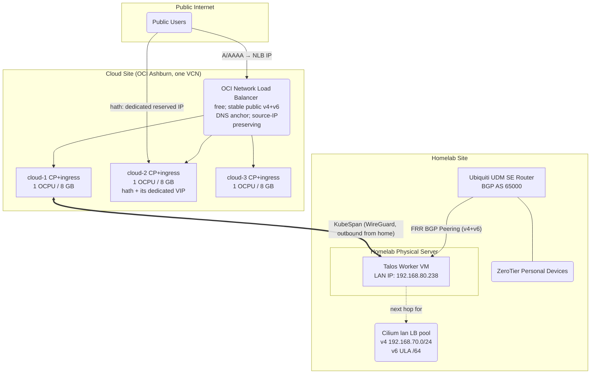

# Next-Generation Hybrid Kubernetes Cluster Architecture

Objective: Deploy a high-performance hybrid Kubernetes cluster spanning an
OCI cloud site and a Homelab LAN. Ensure low stack complexity, minimal vendor
lock-in, and declarative management using Pulumi.

> **Status**: This is the canonical architecture document, describing the
> design **as decided 2026-08-22** (control plane in the cloud on 3× OCI
> A1 nodes; two-pool LoadBalancer ingress; UDM automated via a gw-config
> provider; HAOS adopted into the physical layer). Superseded approaches
> and their reasoning live in §6; sizing, provider pricing, and HA tiers
> live in [nodes.md](nodes.md); storage in [storage.md](storage.md). The
> code in `src/kluster/physical/aws.py` predates all of this and will be
> replaced during implementation.

## 1. Architecture Overview

### 1.1 High-Level Design

-   **Cloud site (OCI, Ashburn)**: **three A1.Flex nodes (1 OCPU / 8 GB
    each) forming the HA control plane** — etcd quorum stays within one
    region, so Raft never crosses the WAN — and simultaneously serving as
    the ingress/worker pool for internet-facing and stable-IP workloads
    (hath). Sits inside the OCI free envelope today; ≤ ~$21/mo worst case
    (nodes.md §3.2).
-   **Homelab site**: one large Talos **worker** VM on the physical server
    (libvirt) for internal, NAS-coupled, GPU, and bulk-egress workloads.
    The home site holds the data gravity; the cloud site holds the
    control plane and the public face. **No inbound ports are required at
    the home network** (§5.1).
-   **OS**: Talos Linux (immutable, API-driven) on every node; the entire
    machine config is Pulumi-rendered.
-   **Transport / Underlay**: Talos KubeSpan (WireGuard mesh) for encrypted
    node-to-node communication across the public internet; the homelab
    worker initiates outbound to the cloud nodes' public endpoints.
-   **CNI & Routing**: Cilium (eBPF-based, kube-proxy replacement).
-   **Ingress (both sides, unified)**: every exposed app is a
    `type: LoadBalancer` Service drawing from one of two Cilium LB IPAM
    pools — `internet` (the cloud nodes' primary public IPs, fronted by
    the free OCI NLB) or `lan` (dedicated dual-stack subnet BGP-announced
    to the UDM SE). HTTP/S goes through Cilium Gateway API (Envoy)
    gateways that are themselves LoadBalancer Services from these pools
    (§3).
-   **Egress**: default per-node local egress; bulk egress stays on the home
    uplink; Cilium Egress Gateway available for stable-IP steering (§3.5).

### 1.2 Network Topology

### 1.3 IP Stack Architecture: Dual-Stack (IPv4 Primary)

The cluster will operate in Dual-Stack mode, prioritizing IPv4.

-   **Why not IPv6-only?** Many legacy apps hardcode 0.0.0.0, and crucial
    container registries like ghcr.io do not support IPv6.
-   **Talos Configuration Rule**: You must define the IPv4 CIDRs first in the
    machine.network arrays to establish IPv4 as the primary family,
    preventing subtle ecosystem bugs.
-   **LAN IPv6 uses ULA**: the home GUA prefix is not stable, so the LAN LB
    pool's v6 addresses come from a dedicated ULA range (exact range chosen
    at implementation; avoid the UDM `::` anycast trap — always `::1`-style
    host addresses). Known consequence: RFC 6724 source/destination
    selection makes clients prefer IPv4 when the AAAA is ULA — v6 on the LAN
    is architecture-complete but rarely chosen by clients until a stable GUA
    prefix exists.

## 2. Core Infrastructure Components

### 2.1 Talos Linux Features ([Docs](https://www.talos.dev/))

-   **KubeSpan**: Native WireGuard mesh. Handles NAT traversal automatically
    because the cloud nodes have public IPs, allowing the Homelab worker to
    initiate all connections outbound — no home-side pinholes.
-   **KubePrism**: A local HAProxy load balancer running on every node
    (localhost:7445) that balances across all three apiservers. Every node
    and in-cluster component points at this instead of any hardcoded API
    IP; external clients use the NLB endpoint instead (§3.2).

### 2.2 Cilium eBPF CNI ([Docs](https://docs.cilium.io/))

-   **Kube-Proxy Replacement**: kube-proxy is disabled in Talos. Cilium
    handles all L3/L4 routing directly in the kernel using eBPF, eliminating
    iptables bottlenecks.
-   **Bootstrap Requirement**: Because kube-proxy is disabled, the Cilium
    Helm chart must explicitly point to KubePrism (k8sServiceHost: localhost,
    k8sServicePort: 7445) to reach the API server on startup.

## 3. Ingress, Egress & Load Balancing

### 3.1 One model for both sides: two LB IPAM pools

Every externally reachable app — cloud-facing or LAN-facing, HTTP or raw
TCP/UDP — is a `type: LoadBalancer` Service drawing its VIP from one of two
`CiliumLoadBalancerIPPool`s. The two sides are symmetric; only how packets
reach the VIP differs:

| Pool | Addresses | How traffic reaches the VIP |
| --- | --- | --- |
| `internet` | The three cloud nodes' **primary** public IPv4 + IPv6 (§3.2) | OCI routes each IP to its node; the free NLB fans the stable public front IP out across healthy nodes; no announcement needed |
| `lan` | Dedicated dual-stack subnet, e.g. `192.168.70.0/24` + a ULA `/64` — deliberately *not* inside the LAN's `192.168.80.0/24` | BGP-announced to the UDM SE (§3.4) |

This works because Cilium's kube-proxy replacement installs BPF service
entries for LoadBalancer frontends on the node regardless of whether any
announcement mechanism is active — LB IPAM (allocation) is decoupled from
BGP/L2 (advertisement). Packets arriving at the cloud node for the VIP are
DNAT'd in-kernel; announcement only exists to make the network route the IP
to a node, which the cloud provider (static routing) and the UDM (BGP)
respectively already do.
([LB IPAM docs](https://docs.cilium.io/en/stable/network/lb-ipam/),
[KPR docs](https://docs.cilium.io/en/stable/network/kubernetes/kubeproxy-free/).)

Mechanics shared by both pools:

-   **Pool selection** via a Service label matched by the pool's
    `serviceSelector`. A Service that must be on both sides is simply two
    Services (or one per side attached to the same pods).
-   **IP sharing**: `internet` Services all request the same three
    primary IPs (`lbipam.cilium.io/ips` + a `sharing-key`, ports
    disambiguate — §3.2); `lan` Services normally take one IP each (the
    pool is plentiful).
-   **Backends may live on any node.** With `externalTrafficPolicy: Cluster`
    the receiving node SNATs and forwards over KubeSpan to a remote backend
    — a public port can front a homelab pod. Cost: the backend
    sees the ingress node's IP, not the client's. Use
    `externalTrafficPolicy: Local` (client IP preserved, no extra hop) only
    when the backends are pinned to the VIP-owning node. DSR is not usable
    across the WG/NAT path — stick with SNAT.

### 3.2 The internet side: NLB in front, primary IPs underneath

Internet ingress is two layers, both free:

1.  **The NLB is the stable public anchor.** All public A/AAAA records
    point at the free OCI Network Load Balancer's IP — which is
    independent of every instance, so node rebuilds never touch DNS. The
    NLB is L3/4 pass-through with **source-IP preservation** and health
    checks; one listener per public port (80, 443, syncthing 22000/tcp+udp,
    …), backend set = the three cloud nodes.
2.  **Cilium terminates on the node primary IPs.** The `internet` pool
    contains all three nodes' primary IPs; every internet Service
    requests *all three* via the `lbipam.cilium.io/ips` annotation (plus
    a `sharing-key`, ports disambiguate). The NLB DNATs the front IP to a
    healthy backend node's primary IP, where the KPR datapath matches the
    frontend and forwards to a pod — locally (`externalTrafficPolicy:
    Local`, client IP preserved end-to-end through the pass-through NLB)
    or via SNAT to another node (`Cluster`).

Datapath-wise the node-side half is identical to `externalIPs` handling
(KPR treats both frontend classes the same, claiming only declared
service ports and leaving host traffic — KubeSpan, Talos apid — alone).
Caveats accepted knowingly, each with a cheap fallback:

-   Cilium doesn't officially bless a pool containing node IPs (LB IPAM
    validates only pool-vs-pool overlap) — **verify at bootstrap**;
    fallback is a reserved additional IP per node ($0 on OCI).
-   NLB dual-stack (v6 listener) and exact source-preservation semantics
    on a dual-stack VCN — **verify at bootstrap**; fallback is
    multi-A/AAAA DNS straight at the three node primary IPs (loses
    health-checked failover, keeps everything else).

**Dedicated VIPs for same-IP workloads (hath).** Some protocols require
inbound and *outbound* on one stable IP — no NLB can satisfy that
(nothing can source traffic from the NLB's address). For these the
`internet` pool carries a second address class: an OCI **reserved
public IP** ($0, region-scoped, instance-independent) 1:1-NAT'd by OCI
to a **secondary private IP** on some node's VNIC. Inbound: the
workload's LoadBalancer Service requests that private IP from the pool
— an ordinary Service. Outbound: a `CiliumEgressGatewayPolicy` with
`egressIP` = the same private IP sources the workload's egress through
it, which OCI NATs back to the reserved IP. In/out match, and the IP
survives node replacement — re-homing is one Pulumi diff (reassign the
reserved IP, move the policy), no re-registration, and the pattern is
placement-agnostic (the pod may even run homelab-side; egress just
crosses KubeSpan to the gateway node). hath is the only current user;
its practical node-stickiness comes from its RWO cache volume, not
from networking. Bootstrap verification: Egress Gateway under the
chosen routing mode (tunnel-mode EGW needs Cilium ≥1.16) and the
reserved-IP↔secondary-private-IP NAT semantics.

**The management plane rides the same NLB**: listeners for 6443
(kube-apiserver) and 50000 (Talos apid) across the three CP nodes give
kubectl/talosctl one stable, health-checked, mTLS-authenticated public
endpoint (cert SANs include the NLB IP). No home-side path is involved
in managing the cluster.

**Escape hatch — client-IP-sensitive non-HTTP on the homelab pool**: if a
raw TCP/UDP service ever both needs real client IPs *and* must run
homelab-side (too big for the cloud pool), the cloud path can't serve it
(`Cluster` SNATs, `Local` needs local backends, DSR can't cross WG/NAT).
Expose it via the **home uplink** instead: UDM port-forward to its `lan`
VIP — DNAT preserves the source address end-to-end. Costs: home-IP DNS
(dynamic) and home upload bandwidth. No current workload needs this; it
exists so the constraint never forces a redesign.

### 3.3 HTTP/S: two Gateways, shared routes

Cilium Gateway API provides two `Gateway`s: `internet-gw` and `lan-gw`,
each a LoadBalancer Service from its pool. An app publishes an
`HTTPRoute` with one or both as `parentRefs`; split-horizon apps
(immich) attach to both.

Client-IP note: `internet-gw`'s Envoy runs as replicas across the cloud
nodes (every NLB backend has a local Envoy) with
`externalTrafficPolicy: Local` — real client IPs flow through the
pass-through NLB into Envoy's access logs and auth decisions without
X-Forwarded-For games. `lan-gw`'s Envoy is pinned to the homelab VM
(the node owning its `lan` VIP), likewise `Local`.

### 3.4 LAN specifics: BGP to the UDM, dedicated subnet, split DNS

1.  **Dedicated subnet**: the `lan` pool (`192.168.70.0/24` + ULA `/64`)
    sits outside any existing VLAN subnet, so there is no ARP/ND ambiguity
    and no L2 announcement machinery — it is a purely routed subnet whose
    next hop (the Talos VM) is learned via BGP. It is deliberately **not a
    VLAN/network object on the UDM**: the UDM never hosts this subnet at
    L2 (no interface in it, no DHCP); creating it as a VLAN would make the
    UDM believe the subnet is directly connected and fight the BGP /32s.
    Firewall policy references it via address groups instead. The ULA
    range follows the same `::1`-style host-address discipline as §1.3.
2.  **BGP session**: CiliumBGPPeeringPolicy peers with the UDM SE (FRR,
    AS 65000) over both address families, advertising Service VIPs as
    /32 + /128 (§5.2 automates the UDM side).
3.  **Router config**: the UDM must (a) route the ZeroTier subnet to the
    pool, and (b) have firewall rules for the new subnet — BGP-learned
    routes bypass VLAN isolation defaults, so inter-VLAN policy must name
    `192.168.70.0/24` explicitly.
4.  **Split-horizon DNS**: AdGuard (alice/bob) rewrites public hostnames to
    `lan` VIPs so LAN/ZT clients reach apps (immich!) directly, never via
    the cloud path — preserving the legacy cluster's hard-earned rule that
    LAN access to immich must not traverse the VPS.

### 3.5 Egress Design

-   **Default**: pods egress via their own node (cloud pods → that
    node's primary IP, homelab → home uplink). The three cloud nodes
    thus present three egress identities — irrelevant to every current
    workload; anything ever needing one fixed cloud egress IP steers
    through a Cilium Egress Gateway policy via a chosen node. The OCI
    10 TB/mo egress allowance is tenancy-wide, shared by all three.
-   **Bulk egress (qbittorrent, seeding, large syncs)**: pinned to the
    homelab pool; leaves via the home uplink. Never routed through a
    metered-egress cloud path.
-   **qbittorrent's IPv6** (the reason it never joined the legacy cluster):
    outbound v6 works via Cilium's IPv6 masquerade to the homelab VM's GUA
    (SLAAC on the LAN bridge); inbound v6 peers need a UDM firewall
    pinhole to the VM's GUA plus the service port — an ordinary UniFi
    firewall rule (pulumiverse/unifi provider or UI; prefix-relative
    because the home GUA prefix is dynamic), *not* gw-config territory.
    "Outbound-only v6" is an acceptable first stage (peers are mostly
    reachable outbound; inbound v4 continues via the existing port
    forward).
-   **Stable-IP workloads (hath)**: served by the dedicated-VIP pattern
    (§3.2) — reserved public IP in, Egress Gateway `egressIP` out, same
    address both ways, independent of any node's lifecycle. The pattern
    is placement-agnostic: hath normally runs on the VIP's gateway node
    (cache locality, zero extra hops), but if its storage ever outgrows
    the free block allowance it moves to the homelab with the *same*
    Service and policy — egress simply crosses KubeSpan to the gateway
    node. This one mechanism replaces both the legacy hand-rolled
    WireGuard-gateway-pod hack and the earlier pinned-primary-IP
    special case. Egress Gateway is v4-mature (hath is v4-only).

### 3.6 Workload Routing Decision Matrix

Deploying an app now answers exactly two questions — *which pool(s)* and
*HTTP or not*:

| Workload | Pool | Route kind |
| --- | --- | --- |
| Public HTTP/S (blog, authelia, splitpro) | `internet` | HTTPRoute → `internet-gw` (via NLB) |
| LAN HTTP/S (jellyfin, immich fast path) | `lan` | HTTPRoute → `lan-gw` |
| Split-horizon HTTP/S (immich) | both | HTTPRoute → both gateways |
| Public raw TCP/UDP (syncthing 22000) | `internet` | LoadBalancer Service + NLB listener |
| LAN raw TCP/UDP | `lan` | LoadBalancer Service |
| Same-IP-in/out (hath) | `internet` | LoadBalancer Service on a dedicated VIP + EgressGatewayPolicy (§3.2) |

Placement (which node runs the pods) is orthogonal for every row — set
by scheduling constraints, with §3.5's egress rules deciding it for
bulk-egress workloads and storage locality deciding it for hath.

## 4. Security & Observability

### 4.1 Threat Model: KubeSpan vs mTLS

-   **Transport Security**: KubeSpan encrypts all inter-node traffic
    traversing the public internet via WireGuard.
-   **Node Compromise**: If a Talos node is compromised, the attacker has
    kernel access; mTLS certificates would be compromised anyway. Talos's
    immutable, API-only architecture mitigates this.
-   **Pod Compromise**: mTLS does not prevent a compromised pod from using
    its legitimate access. Therefore, we use Cilium Network Policies (eBPF
    L3/L4/L7 rules) to strictly isolate namespaces and pods, which is
    superior to complex sidecar-based mTLS.

### 4.2 L7 Observability (Hubble)

By enabling Hubble within Cilium, the eBPF datapath and Envoy proxies provide
deep observability into HTTP paths, gRPC codes, and DNS queries without
requiring application modification.

## 5. Infrastructure as Code (Pulumi Implementation)

The entire stack is deployed via Pulumi using multiple providers:

### 5.1 Infrastructure Provisioning

1.  **Libvirt (pulumi-libvirt)**: Provisions the Talos VM on the Homelab
    physical server (bridged to the LAN). Outputs the dynamically
    assigned local IP. The same provider also adopts the **existing HAOS
    VM** into the physical layer (import, then declare) — HAOS stays a
    host-level libvirt domain, deliberately outside the cluster (§6.8).
2.  **OCI (pulumi-oci)**: Provisions the dual-stack VCN (v4 + /56 GUA
    v6), the three A1 instances (Talos via custom image import), their
    primary IPs, the NLB (listeners + backend sets, §3.2), block
    volumes, and security lists.
    -   Security rules and NLB listeners are derived from declarations,
        not hand-listed: the platform baseline (KubeSpan, management,
        intra-VCN) lives in the physical stack; per-service ports are
        emitted beside the services that use them
        (declarative/physical.md §1).
    -   Guardrails (nodes.md §3.2): compartment quotas pinning creatable
        shapes to the free envelope + budget alerts.
3.  **UniFi (pulumiverse/unifi)**: firewall rules only — the `lan` pool
    subnet policy (§3.4) and the qbittorrent v6 pinhole (§3.5).
    **No inbound port-forwards exist at the home network**: the control
    plane lives cloud-side, the homelab worker dials out (KubeSpan), and
    management traffic terminates at the NLB. Personal devices continue
    to reach LAN services over ZeroTier.
4.  **Cloudflare (pulumi-cloudflare)**: **all** public DNS records move
    into Pulumi — zones/estate/anchors in the `dns` stack, per-app
    records beside their apps (declarative/dns.md). The standalone
    DNSControl repo ([Aetf/dns](https://github.com/Aetf/dns)) is
    absorbed and retired — one declarative world, previewable diffs.
    (in-cluster external-dns rejected, §6.4.)
5.  **Backblaze B2 (bridged provider)**: the backup bucket + keys +
    lifecycle rules (see [storage.md](storage.md) §4).

### 5.2 UDM Configuration: a `gw-config` dynamic provider

The unifi provider has no BGP API, but the UDM already has a proven
declarative mechanism: `~/.config/gw-config` (the retiring repo) pushed
desired-state files idempotently over SSH (`deploy.sh`, `/data` +
`on_boot.d` persistence model). Rather than the earlier "generate an FRR
.conf, upload by hand" plan, Pulumi grows a small **dynamic provider that
drives gw-config**:

-   **Resource model**: a `GwFile` (path + content + owner/mode + optional
    post-apply hook such as `vtysh reload` or a container restart) and, on
    top of it, typed resources like `GwFrrConfig`. `diff` compares desired
    content against the device over SSH; `create/update` writes to `/data`
    (surviving firmware updates) and runs the hook. This is exactly
    aconfmgr-style convergence, previewable in `pulumi preview`.
-   **FRR/BGP**: the FRR config (neighbor = the libvirt VM's IP, both
    address families, plus a static route for the `lan` pool subnet's
    firewall context) is rendered from the physical layer's outputs and
    applied through the UniFi BGP feature's config path. If the device-side
    apply hook for FRR proves fragile, fall back to writing the file and
    surfacing a "reload needed" diff — still one source of truth, one less
    manual upload.
-   **Scope — full absorption of the push direction (2026-08-22)**:
    the provider manages *all* desired-state files on the device —
    FRR/BGP, the nspawn estate (unit files, wants-symlinks, rootfs
    image pushes for AdGuard alice/bob and caddy, images from
    `~/homelab-containers`), the on_boot.d recovery scripts (pushed
    files that execute autonomously at firmware updates — Pulumi need
    not be present at boot), caddy config, AdGuard static configs, and
    device-side secrets (from Pulumi config secrets). **The gw-config
    repo retires** with a pointer commit (the old-tracker rule) — one
    source of truth per device. The only survivor outside Pulumi is the
    *pull* direction (periodic UniFi-autobackup and config-snapshot
    retrieval): that is a scheduled job, not desired state, and moves
    to a yadm-managed timer on the homelab host. Firewall-rule needs
    (e.g. the qbittorrent v6 pinhole, §3.5) go through the regular
    unifi provider, not this one.
-   **Images: Pulumi pins and deploys, CI builds.** Image *building* stays
    in homelab-containers' CI (renovate keeps bases fresh; builds are
    slow, cache-dependent, and don't belong inside `pulumi up` —
    pulumi-docker-build exists and is deliberately not used). Pulumi's
    input is a **digest-pinned reference** to a CI-built artifact
    (nspawn rootfs release, or a registry image for in-cluster
    workloads); bumping the pin is the previewed, reviewable deploy
    event. Same discipline as the mise commit-pin pattern already used
    for homelab-ops tooling.

## 6. Alternatives Considered

Superseded designs and rejected ideas, kept with their reasoning so they
are not re-litigated from scratch. §6.5 documents the largest reversal
(control-plane placement, 2026-08-22).

### 6.1 IPv6-Only VPC + NAT64

-   **The Idea**: Use an IPv6-only VPC to avoid the recurring monthly
    *charge* for an in-use public IPv4 address (hyperscalers bill this
    separately since ~2024: ~$3.65/mo on GCP/AWS, ~$0.60 on Hetzner — see
    nodes.md §3; the address itself is static, it does not change),
    relying on public DNS64/NAT64 (e.g., nat64.net) or a
    cloud-managed NAT gateway for IPv4-only destinations.
-   **Why it was rejected**:
    1.  **Cost Trap**: Cloud-managed NAT gateways cost ~$32/mo minimum, far
        exceeding the cost of a single static IPv4 address.
    2.  **CLAT Limitations**: Apps that hardcode IPv4 (0.0.0.0, 1.1.1.1) fail
        entirely in IPv6-only environments without complex CLAT translation on
        the node.
    3.  **Stability**: Relying on free, third-party NAT64 introduces a massive
        single point of failure for pulling containers from legacy registries
        like ghcr.io.

### 6.2 WAN-Stretched HA Control Plane (1 Home, 2 Cloud)

-   **The Idea**: Distribute control plane nodes across the Homelab and the
    cloud for high availability.
-   **Why it was rejected (and stays rejected)**: etcd requires
    low-latency Raft consensus. Stretching it over a WAN adds 15–50 ms+
    to every API write, starving the cluster. The adopted design (§1.1)
    gets CP HA *without* violating this: all three etcd members sit in
    one cloud region; only kubelet↔apiserver traffic from the homelab
    worker crosses the WAN, which is ordinary edge-worker behavior.

### 6.3 Cloud-site provider selection

-   The April 2026 plan said GCP e2-medium; the 2026-08-21 review
    tentatively said Hetzner CPX21 on egress economics (~$14 flat, 1 TB
    included). **2026-08-22: Hetzner's 2026-06-15 US price adjustment
    (CPX21 Ashburn $13.99 → $37.49/mo) voids that decision** — the
    selection is reopened and re-argued in nodes.md §3, including the
    GCP mixed-tier option (IPv4 on Standard tier + IPv6 on Premium, which
    dissolves the old "dual-stack forces Premium egress" objection for the
    v4 share of traffic). The architecture is provider-agnostic by
    construction; only nodes.md carries the pricing argument.

### 6.4 In-cluster external-dns

-   Rejected in favor of all DNS records living in Pulumi: same declarative
    world as every other resource, previewable and reviewable diffs. The
    cost — new public apps require a Pulumi change — is acceptable since app
    deployment is a Pulumi change anyway.

### 6.5 Homelab-Hosted Control Plane (the previous design)

-   **The Idea**: a single powerful CP/worker VM in the Homelab, cloud
    node as worker only — this document's design until 2026-08-22, itself
    motivated by the legacy cluster's history: the k3s server on the 8 GB
    VPS was starved (memory pressure throttled the API and broke timely
    workload eviction), so the CP fled to the homelab's abundant RAM.
-   **Why it was superseded** by the 3× cloud-node quorum (§1.1):
    1.  The legacy failure mode was *resource starvation*, not "CP in the
        cloud" per se — 3× dedicated-core A1 nodes with an honest ~4 GB
        CP budget each and working kubelet eviction don't reproduce it.
    2.  The home uplink is the system's least reliable component (UDM
        auto-firmware outage history); a homelab CP freezes cluster
        management — including the healthy cloud side — on every home
        outage. Cloud CP inverts this: a home outage degrades to "one
        worker NotReady" while the public face and management stay up.
    3.  The objections that killed the cloud-CP idea on 2026-08-21 fell
        one by one: cost ($0 today, ≤~$21/mo, nodes.md §3.2), third
        provider (OCI is now *the* cloud site), tiny-VM OOM (8 GB
        dedicated-core shapes are not e2-micro), and management path
        (ZeroTier is no longer load-bearing for kubectl).
    4.  What the homelab CP protected — etcd near the data gravity — was
        worth little: when the home site is down, the API has nothing
        homelab-side to manage anyway, and etcd's durability comes from
        hourly snapshots + the cold-standby drill in either design.
-   Residual risks carried consciously: etcd (cluster secrets) lives in a
    $0-trust tenancy → etcd encryption at rest + hourly snapshots to B2;
    total-tenancy loss → the cold-standby drill runs in reverse
    (bootstrap a temporary single-node CP on the homelab host from the
    latest snapshot, ~30–60 min, nodes.md §5).

### 6.6 hostNetwork Envoy + `externalIPs`/hostPort as the cloud ingress

-   The earlier iteration of this document ran the cloud gateway as
    hostNetwork Envoy on ports 80/443 and exposed raw TCP/UDP via
    `externalIPs` (or hostPort) on the node's primary IPs.
    **Superseded 2026-08-22** by the two-pool LoadBalancer model (§3.1):
    functionally the datapath is identical (KPR treats `externalIPs` and
    LB VIPs as the same frontend class), but the LB model gives one
    uniform mechanism on both sides, `status.loadBalancer` population
    (which Gateway API and DNS tooling read), pool-based allocation
    instead of hand-maintained IP lists. Neither hostPort, `externalIPs`,
    nor hostNetwork gateways are used.

### 6.7 Gateway API TCPRoute/UDPRoute for raw TCP/UDP

-   Rejected: routing raw TCP/UDP through Envoy adds a proxy hop that buys
    nothing for hath/syncthing-class traffic, and TCPRoute/UDPRoute only
    arrive in Cilium 1.20. Plain LoadBalancer Services behind NLB
    listeners (§3.1–3.2) do the job in-kernel with zero extra
    components.

### 6.8 HAOS under KubeVirt

-   **The Idea**: absorb the existing HAOS libvirt VM into the cluster via
    KubeVirt (Talos supports it; CDI can import the qcow2; USB passthrough
    exists since KubeVirt 1.1).
-   **Why it was rejected** (2026-08-22): (a) home automation must keep
    working when the cluster is down or being rebuilt — HAOS on the host's
    libvirt has no cluster dependency; (b) the VM passes through a PCIe
    USB3 controller, the WiFi/BT card, and a USB dongle — KubeVirt USB/PCI
    passthrough has no hot-plug (dongle re-seat ⇒ VM restart) and pins the
    VM anyway, so cluster placement buys nothing; (c) the KubeVirt+CDI+
    Multus(bridge) stack plus Talos-specific friction (SELinux regression
    talos#10083-class issues) is real operational surface for zero gained
    capability. Instead HAOS is **adopted by the Pulumi physical layer via
    pulumi-libvirt** (§5.1): declared, versioned, previewable — but a host
    concern, like the NAS.
