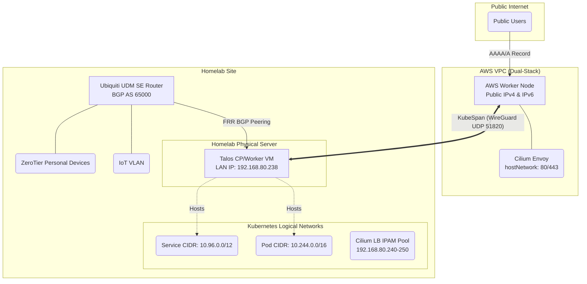

# Hybrid Kubernetes Network Architecture Design

Objective: Deploy a next-generation, high-performance hybrid Kubernetes cluster spanning an AWS VPC and a Homelab LAN. Ensure low stack complexity, minimal vendor lock-in, and declarative management using Pulumi.

## 1. Architecture Overview

### 1.1 High-Level Design

  - Control Plane: Single-node powerful VM in the Homelab. Avoids WAN-latency penalties on etcd.
  - Worker Nodes: AWS VPS handles cloud ingress; Homelab VM handles internal workloads.
  - OS: Talos Linux (Immutable, API-driven).
  - Transport / Underlay: Talos KubeSpan (WireGuard mesh) for encrypted node-to-node communication across the public internet.
  - CNI & Routing: Cilium (eBPF-based, bypassing kube-proxy and iptables).
  - Ingress (Cloud): Cilium Gateway API (Envoy) running in hostNetwork mode.
  - Ingress (LAN): Cilium LB IPAM + BGP Peering with Ubiquiti UDM SE.

### 1.2 Network Topology



### 1.3 IP Stack Architecture: Dual-Stack (IPv4 Primary)

The cluster will operate in Dual-Stack mode, prioritizing IPv4.

  - Why not IPv6-only? Many legacy apps hardcode 0.0.0.0, and crucial container registries like ghcr.io do not support IPv6.
  - Talos Configuration Rule: You must define the IPv4 CIDRs first in the machine.network arrays to establish IPv4 as the primary family, preventing subtle ecosystem bugs.

## 2. Core Infrastructure Components

### 2.1 Talos Linux Features ([Docs](https://www.talos.dev/))

  - KubeSpan: Native WireGuard mesh. Handles NAT traversal automatically because the AWS node has a public IP, allowing the Homelab node to initiate the connection.
  - KubePrism: A local HAProxy load balancer running on every node (localhost:7445). All worker nodes and internal components point to this instead of a hardcoded external API IP.

### 2.2 Cilium eBPF CNI ([Docs](https://docs.cilium.io/))

  - Kube-Proxy Replacement: kube-proxy is disabled in Talos. Cilium handles all L3/L4 routing directly in the kernel using eBPF, eliminating iptables bottlenecks.
  - Bootstrap Requirement: Because kube-proxy is disabled, the Cilium Helm chart must explicitly point to KubePrism (k8sServiceHost: localhost, k8sServicePort: 7445) to reach the API server on startup.

## 3. Ingress & Load Balancing Strategy

### 3.1 Cloud Ingress: Gateway API + HostNetwork

In AWS, L2 announcements and arbitrary BGP IP broadcasts are blocked.

  - Implementation: Enable Cilium Gateway API with hostNetwork: true. Cilium deploys Envoy directly to the AWS node's host interfaces (ports 80/443).
  - Load Balancing: Use standard A/AAAA DNS records pointing directly to the AWS node's public IP. eBPF routes traffic from Envoy to the correct internal pods.

### 3.2 LAN Ingress: Cilium IPAM + BGP Peering

To expose services to the Homelab LAN without port conflicts (avoiding k3s ServiceLB limitations):

1.  IPAM Pool: Define a CiliumLoadBalancerIPPool containing a dedicated range of IPs (e.g., 192.168.80.240-250).
2.  Assignment: When an internal app requests a type: LoadBalancer Service, Cilium assigns it a unique IP from this pool.
3.  BGP Announcement: A CiliumBGPPeeringPolicy tells the Talos VM to establish a BGP session with the UDM SE, advertising the specific Service IPs. External LAN devices can natively route to these virtual IPs without NAT.

### 3.3 Workload Routing Decision Matrix

When deploying an application, use the following rules:

  - Public HTTP/S Apps (e.g., Traefik, blogs): Use Gateway API HTTPRoute.
  - Public TCP/UDP Apps (e.g., Syncthing): Use Gateway API TCPRoute / UDPRoute.
  - Internal LAN Apps (e.g., Jellyfin, Shoko): Use standard Kubernetes Service with type: LoadBalancer.

## 4. Security & Observability

### 4.1 Threat Model: KubeSpan vs mTLS

  - Transport Security: KubeSpan encrypts all inter-node traffic traversing the public internet via WireGuard.
  - Node Compromise: If a Talos node is compromised, the attacker has kernel access; mTLS certificates would be compromised anyway. Talos's immutable, API-only architecture mitigates this.
  - Pod Compromise (e.g., Web RCE): mTLS does not prevent a compromised pod from using its legitimate access. Therefore, we use Cilium Network Policies (eBPF L3/L4/L7 rules) to strictly isolate namespaces and pods, which is superior to complex sidecar-based mTLS.

### 4.2 L7 Observability (Hubble)

By enabling Hubble within Cilium, the eBPF datapath and Envoy proxies provide deep observability into HTTP paths, gRPC codes, and DNS queries without requiring application modification.

## 5. Infrastructure as Code (Pulumi Implementation)

The entire stack is deployed via Pulumi using multiple providers:

### 5.1 Infrastructure Provisioning

1.  Libvirt (pulumi-libvirt): Provisions the Talos VM on the Homelab physical server (passing through NIC/macvlan). Outputs the dynamically assigned local IP.
2.  AWS (pulumi-aws): Provisions the EC2 instance (Dual-Stack) and Security Groups.
  - Required SG Ports: 80, 443 (Ingress), 51820 UDP (WireGuard/KubeSpan).
3.  UniFi (pulumiverse/unifi): Configures port forwarding on the DMSE to allow the AWS node to reach the Homelab Control Plane.
  - Required Ports: 6443 (Kube API), 50000 (Talos API).

### 5.2 BGP Router Configuration (Semi-Automated)

Because the unifi provider does not currently support BGP APIs, Pulumi will use the pulumi-local provider to dynamically generate the required FRR configuration file based on the libvirt VM's state.

  - Action: Take the Pulumi-generated .conf file and manually upload it via the UDM SE web interface.

Generated FRR Template Example:

```text
router bgp 65000  
 neighbor {Homelab_VM_IP} remote-as 65000  
 neighbor {Homelab_VM_IP} update-source br0  
address-family ipv4 unicast  
 neighbor {Homelab_VM_IP} activate  
exit-address-family  
```

## 6. Alternatives Considered

### 6.1 IPv6-Only VPC + NAT64

  - The Idea: Use an IPv6-only AWS VPC to avoid the $3.65/mo public IPv4 charge, relying on public DNS64/NAT64 (e.g., nat64.net) or GCP/AWS NAT Gateways.
  - Why it was rejected:
    1.  Cost Trap: Cloud-managed NAT Gateways cost ~$32/mo minimum, far exceeding the cost of a single static IPv4 address.
    2.  CLAT Limitations: Apps that hardcode IPv4 (0.0.0.0, 1.1.1.1) fail entirely in IPv6-only environments without complex CLAT translation on the node.
    3.  Stability: Relying on free, third-party NAT64 introduces a massive single point of failure for pulling containers from legacy registries like ghcr.io.

### 6.2 Three-Node HA Control Plane (1 Home, 2 Cloud)

  - The Idea: Distribute control plane nodes across the Homelab and AWS for high availability.
  - Why it was rejected: etcd requires low-latency Raft consensus. Stretching it over a WAN adds 15ms-50ms+ latency to every API write, starving the cluster. Additionally, "tiny" cloud VMs are prone to OOM kills running etcd. A single, powerful Homelab node with S3 backups is significantly faster and more stable.
