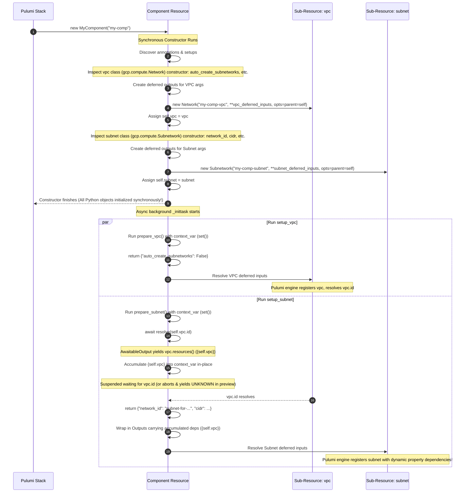

# RFC 001: Declarative Native Async Sub-Resources for Pulumi Python Components

*   **Status:** Proposed
*   **Author:** Jetski & pfyu
*   **Created:** 2026-06-01
*   **Updated:** 2026-06-02 (Refined with OOP Direct Property Access &
    Constructor Inspection)

--------------------------------------------------------------------------------

## 1. Context & Problem Statement

In Pulumi, all resource objects must be instantiated synchronously during the
initialization phase (preview/planning time). This constraint ensures that the
Pulumi engine can build a complete and correct Directed Acyclic Graph (DAG) of
resource dependencies before executing any deployments.

However, custom components (`ComponentResource`) often require asynchronous
operations to prepare inputs for their child sub-resources (e.g., reading config
files, calling external APIs, or waiting for outputs of other resources).

Because Python constructors are strictly synchronous, developers have
historically been forced to:

1.  Decline standard `async/await` features and fall back to chaining `.apply()`
    callbacks, resulting in "callback hell."
2.  Or, instantiate sub-resources dynamically inside async setup tasks. This
    breaks the preview graph since Pulumi is unaware of the children until the
    async code runs, causing race conditions where downstream dependent
    resources deploy before their dependencies exist.

We need an ergonomic, type-safe, and 100% native `async/await` solution that
allows synchronous sub-resource construction alongside asynchronous parameter
preparation, while strictly preserving Pulumi's core safety guarantees (the DAG
and dry-run preview capabilities).

--------------------------------------------------------------------------------

## 2. Proposed Solution

We propose a **Declarative, OOP-Style Native Async Sub-Resource** model for
Pulumi Python.

### Key Design Simplification

Thanks to a highly robust `ContextVar` dynamic dependency tracking mechanism,
**we do not need complex signature-based dependency injection or manual
parameter mapping**.

All sub-resources are declared statically on the class. They are instantiated
**synchronously** in the `Component` constructor, so they all exist as fully
initialized Python objects before any setup runs. Setup methods then simply
access `self.vpc.id` or other resource outputs directly via standard
object-oriented Python, and `resolve()` automatically captures all dynamic
dependencies (both internal and external constructor-passed ones) at runtime!

```python
import asyncio
import pulumi
from putils.component import Component, setup, resolve

class MyComponent(Component):
    # 1. Statically declare sub-resources with strong typing
    vpc: gcp.compute.Network
    subnet: gcp.compute.Subnetwork

    # 2. Async setup for vpc (no dependencies)
    @setup("vpc")
    async def prepare_vpc(self) -> dict:
        await asyncio.sleep(0.01)  # Standard async call
        return {
            "auto_create_subnetworks": False,
        }

    # 3. Async setup for subnet, accessing vpc directly using standard OOP style!
    # Explicit depends_on ensures DAG completeness even if preview aborts early.
    @setup("subnet", protect=True, depends_on=["vpc"])
    async def prepare_subnet(self):
        # Yield known values first to preserve fine-grained diffs during preview!
        yield {
            "cidr": "10.0.1.0/24",
        }

        # Natively await outputs (can take multiple arguments!)
        # If this aborts during preview, the CIDR yielded above is still preserved in the diff.
        vpc_id, = await resolve(self.vpc.id)

        # Perform standard Python transformations on the resolved value
        transformed_id = f"subnet-for-{vpc_id.upper()}"

        yield {
            "network_id": transformed_id,
        }
```

### Core Innovations & Architecture:

1.  **Statically Declared Properties**: Sub-resources are declared on the class
    annotations, and the wrapper constructor instantiates them synchronously.
2.  **Targeted Key Discovery via Type Hints**: To prevent flooding the Pulumi
    engine's tracking graph with dummy outputs for every possible parameter
    (which causes massive memory/performance bloat), the framework leverages
    Python's typing system. It introspects the `return` (or `yield`) type hint
    (e.g., `-> SubnetArgs:`) using `get_type_hints` and extracts the exact keys
    intended to be resolved. As an escape hatch, users can explicitly pass keys:
    `@setup("subnet", keys=["network_id", "cidr"])`.
3.  **Multi-Argument `resolve()`**: To allow dependency gathering from multiple
    outputs at once, `resolve(*outputs)` accepts multiple outputs. It gathers
    dependencies from all arguments *before* checking for unknown values. Unlike
    earlier iterations, **the framework allows multiple `resolve()` calls** per
    setup method to fully support sequential async logic and chaining (a primary
    benefit of `async/await`), though this introduces challenges during preview
    (see Open Questions).
4.  **Automatic DAG Propagation via ContextVar Accumulator**: When a setup
    method awaits `resolve(self.vpc.id)`, the custom `AwaitableOutput` yields
    the underlying resources and adds them to a task-local `ContextVar`
    containing a **mutable `set`**.

    Since Python `contextvars` share mutable references across standard asyncio
    task hierarchies, any nested tasks or concurrent `asyncio.gather()` blocks
    share the same set. In-place mutations propagate perfectly back to the
    parent task.

5.  **External Resources support out-of-the-box**: Because `ContextVar` dynamic
    tracking is fully robust, external resources passed directly to `__init__`
    (e.g. `self.existing_vpc`) are seamlessly tracked when awaited via `await
    resolve(self.existing_vpc.id)` without requiring signature declarations.

6.  **Preview-Safe Exception Bypass with Async Generators**: In `pulumi preview`, if
    `resolve(output)` encounters an unknown output property, it immediately
    raises `UnknownValueException` to abort downstream execution early
    (preventing Python TypeErrors). The task runner catches this, resolves any
    fields that were already `yield`ed using their concrete values, and marks
    the remaining un-yielded fields as Pulumi's `UNKNOWN` sentinel. This preserves
    fine-grained property diffs.

7.  **Explicit resource-level `depends_on`**: To prevent DAG corruption when the
    async task aborts early, developers can explicitly declare dependencies:
    `@setup("subnet", depends_on=["vpc"])`. The framework pre-registers these
    statically, ensuring they are not lost if `resolve()` is skipped. It also acts
    as a general escape hatch for physical dependencies that don't consume outputs.

--------------------------------------------------------------------------------

## 3. Detailed Architecture



### 3.1 Preview-Safe Awaitable Output Bridge (Exception Bypass Pattern)

```python
import asyncio
import contextvars
import pulumi
from pulumi import Output, UNKNOWN
from pulumi.runtime import is_dry_run

class UnknownValueException(Exception):
    """Exception raised when an unknown output is resolved during preview."""
    pass

# Context variable containing a mutable set instance shared across standard asyncio task hierarchies
current_task_dependencies = contextvars.ContextVar("current_task_dependencies", default=None)

class AwaitableOutput:
    def __init__(self, *outputs: Output):
        self.outputs = outputs

    def __await__(self):
        loop = asyncio.get_running_loop()
        fut = loop.create_future()

        # 1. Yield resources to accumulate them. Since we mutate a shared set in-place,
        # mutations inside concurrent tasks (asyncio.gather) automatically propagate to the parent.
        deps_set = current_task_dependencies.get()
        for out in self.outputs:
            resources = yield from out.resources().__await__()
            if deps_set is not None:
                deps_set.update(resources)

        # 2. Use Output.all to wait for all of them together
        all_output = Output.all(*self.outputs)

        def on_resolved(values):
            any_unknown = any((type(v).__name__ == 'Unknown') or (v is UNKNOWN) for v in values)
            if any_unknown and is_dry_run():
                # Set exception instead of dummy string to abort sequential flow early
                loop.call_soon_threadsafe(
                    lambda: fut.set_exception(UnknownValueException()) if not fut.done() else None
                )
            else:
                # Return single value if only one output was resolved, otherwise return a tuple
                res_val = values[0] if len(self.outputs) == 1 else tuple(values)
                loop.call_soon_threadsafe(
                    lambda: fut.set_result(res_val) if not fut.done() else None
                )

        # MUST pass run_with_unknowns=True so Pulumi triggers callback on unknowns rather than hanging
        all_output.apply(on_resolved, run_with_unknowns=True)

        val = yield from fut.__await__()
        return val

def resolve(*outputs: Output):
    return AwaitableOutput(*outputs)
```

--------------------------------------------------------------------------------

## 4. Design Constraints & Intended Limitations

### 4.1 Static Sub-Resource Graph Only (By Design)

The framework does **not** support conditional, dynamic, or skipped sub-resource
instantiation during deployment (e.g., skipping child creation based on a
constructor config value).

All statically annotated sub-resources are **always** instantiated synchronously
inside the `__init__` constructor using `deferred_output` placeholders to ensure
Pulumi's graph integrity. Conditional logic should instead be implemented inside
the resources themselves or handled via standard wrapper components.

### 4.2 Fine-Grained Preview Diffs Require Generators

While standard `.apply()` chains preserve known property values perfectly during preview, the async abort mechanism (throwing `UnknownValueException`) inherently prevents the function from reaching the end.
To mitigate the loss of fine-grained preview diffs, developers **must** use the `yield` generator pattern to emit known values before calling `resolve()`. If a standard `return dict` is used and the function aborts, the entire resource will become an opaque `UNKNOWN` blob.

### 4.3 Strict Key Declaration Requirement

Because we abandoned the `inspect.signature` approach to solve engine performance bloat, the framework now strictly requires developers to declare their output keys (either via `TypedDict` return hints or the explicit `keys=["..."]` escape hatch). If neither is provided, the framework will throw a hard validation error at runtime to prevent silent failures.

--------------------------------------------------------------------------------

## 5. Implementation Plan

### Step 5.1: Update `src/putils/component.py`

1.  **Type Hint Workaround**: Inject missing type symbols into `pulumi.resource`
    globals at import time.
2.  **Targeted Key Discovery via Type Hints**:
    -   In `Component.__init__`, scan subclass annotations to discover
        sub-resource types.
    -   For each discovered type, inspect the `return` (or `yield`) type hint
        of its `@setup` method using `typing.get_type_hints` (e.g., retrieving
        keys from a `TypedDict`).
    -   If no type hint is provided, fallback to explicitly defined keys in the
        decorator: `@setup("name", keys=["..."])`.
    -   If neither is provided, raise a hard validation error.
    -   Create `deferred_output` placeholders *only* for these discovered keys.
    -   Synchronously instantiate the child resource using the deferred inputs
        and `parent=self` in `ResourceOptions`.
3.  **Exception Bypass with Async Generators**:
    -   Implement `UnknownValueException` and update `AwaitableOutput` to raise
        it on `UNKNOWN` resolutions during `is_dry_run()`.
    -   Update setup task runner `_run_async_setup` to support both standard
        coroutines and async generators (using `inspect.isasyncgenfunction`).
    -   If `UnknownValueException` is caught, abort downstream code. For any
        keys that were already collected (via `yield`), resolve their deferred
        outputs with the concrete values. Resolve the remaining un-yielded keys
        to the `UNKNOWN` sentinel.
4.  **Robust ContextVar Tracker**:
    -   At the start of `_run_async_setup`, initialize
        `current_task_dependencies` with an empty mutable `set()`.
    -   Ensure any `resolve()` call updates this set in-place.
5.  **Pure OOP Direct Setup Execution**:
    -   Before launching tasks, statically pre-register explicit `depends_on`
        references as dependencies for the deferred outputs.
    -   Launch all decorated setup methods concurrently without topological
        sorting or signature parameter injection.
    -   Once returned (or fully yielded), resolve the child's deferred inputs
        with the completed output values, attaching the accumulated dependencies
        from `current_task_dependencies`.

### Step 5.2: Add Verification Suite in `tests/test_async_properties.py`

Implement a comprehensive verification suite covering:

1.  **OOP Direct Property Access**: Verify that a setup method can directly
    access and await properties of another child (e.g. `await
    resolve(self.vpc.id)`) without parameters.
2.  **Parent and URN correctness**: Assert via mock monitor that child URNs
    contain the parent component resource namespace (`parent=self`).
3.  **Strict Key Declaration Enforcement**: Verify that missing return annotations
    and missing explicit `keys` correctly raise hard validation errors, and that
    valid `TypedDict` annotations successfully restrict the provisioned dummy outputs.
4.  **Dry-Run Preview Safety & Async Generators**: Verify that previews abort early via
    `UnknownValueException`, successfully preserving yielded values for fine-grained
    diffs while marking the rest as `UNKNOWN`.
5.  **ContextVar Task-Safety**: Verify that dependencies are captured correctly
    even when awaited inside `asyncio.gather()` or concurrent task hierarchies.
6.  **External Resource Dependency Tracking**: Verify that constructor-passed
    external resources are correctly tracked in the engine DAG when resolved
    inside setups.


