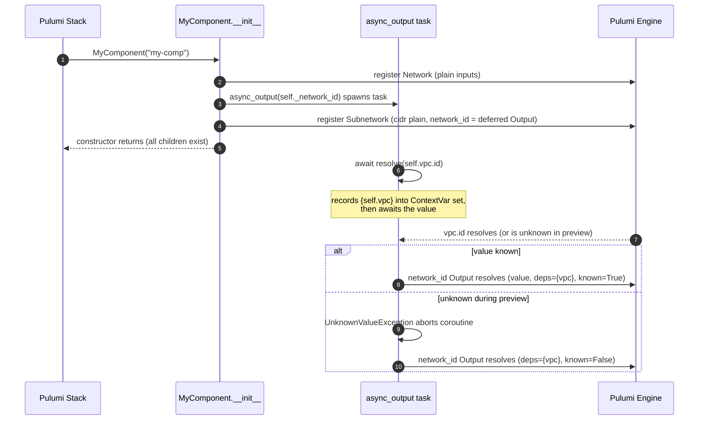

# RFC 001: Native Async Inputs for Pulumi Python Components

*   **Status:** Implemented, 2026-08-15, when Rev 3 removed the last of the
    legacy flow. The text below is kept as the accepted proposal rather than
    as a description of the system: what the framework *is* lives in
    [framework/pulumi.md](../framework/pulumi.md) §1 and §2, and the
    implementation is `src/putils/`. Where this text and that document
    disagree, the document is right.
*   **Author:** Jetski & pfyu
*   **Created:** 2026-06-01
*   **Updated:** 2026-07-02 (Rev 2: per-input redesign, supersedes the
    per-resource `@setup` design)
*   **Updated:** 2026-08-15 (Rev 3: secretness propagation, hard error on
    `resolve` outside `async_output`, simplified implementation, legacy
    `setup()` flow removed, relationship to upstream `pulumi.run`)

--------------------------------------------------------------------------------

## 1. Context & Problem Statement

In Pulumi, all resource objects must be instantiated synchronously during the
initialization phase (preview/planning time). This constraint ensures that the
Pulumi engine can build a complete and correct Directed Acyclic Graph (DAG) of
resource dependencies before executing any deployments.

However, custom components (`ComponentResource`) often require asynchronous
operations to prepare inputs for their child sub-resources (e.g., reading config
files, calling external APIs, or waiting for outputs of other resources).

Because Python constructors are strictly synchronous, developers have
historically been forced to:

1.  Decline standard `async/await` features and fall back to chaining `.apply()`
    callbacks, resulting in "callback hell."
2.  Or, instantiate sub-resources dynamically inside async setup tasks. This
    breaks the preview graph since Pulumi is unaware of the children until the
    async code runs, causing race conditions where downstream dependent
    resources deploy before their dependencies exist.

We need an ergonomic, type-safe, and 100% native `async/await` solution that
allows synchronous sub-resource construction alongside asynchronous parameter
preparation, while strictly preserving Pulumi's core safety guarantees (the DAG
and dry-run preview capabilities).

--------------------------------------------------------------------------------

## 2. Rev 2: Why the Per-Resource `@setup` Design Was Replaced

Rev 1 bundled *all* inputs of a sub-resource into one `@setup` method returning
a dict, with sub-resources declared as class annotations and instantiated by
the framework. Because the deferred placeholder Outputs had to be created
before the setup ran, and because a preview abort lost every key of the dict at
once, Rev 1 was forced to grow:

*   **Key discovery machinery** — TypedDict return-hint introspection, a
    `keys=[...]` escape hatch, and strict validation errors;
*   **An async-generator `yield` protocol** — the only way to preserve
    fine-grained preview diffs when a later `resolve()` aborted;
*   **String-based `depends_on` + topological sorting** — to order
    framework-driven instantiation;
*   **Monkeypatching `pulumi.resource` module globals** — so `get_type_hints`
    could resolve annotations on Pulumi's own base classes.

Review of the Rev 1 implementation also surfaced silent failure modes inherent
to the indirection: a typo'd `depends_on` name was silently dropped, a
`@setup("name")` that matched no annotation silently never ran, and during a
real update a missing dict key silently became `UNKNOWN`.

All of that is accidental complexity from choosing the wrong granularity. Rev 2
inverts it: **one async function per input**, not one setup method per
resource. Pulumi's own type system already points this way — `Input[T]` is
defined as `Union[T, Awaitable[T], Output[T]]`; the only missing pieces are
dependency tracking and unknown-safety, which is exactly and *only* what this
framework now provides.

--------------------------------------------------------------------------------

## 3. Proposed Solution

Two small primitives in `putils.paio`, plus one convenience helper on
`putils.Component`:

*   **`async_output(fn) -> pulumi.Output`** — runs a coroutine and exposes its
    result as an Output usable directly as a resource input, carrying every
    dependency the coroutine touched and the secretness of every output it
    resolved.
*   **`await resolve(*outputs)`** — natively awaits Pulumi outputs inside such
    a coroutine, recording the resources behind them as dependencies and
    their secretness.
*   **`Component.child_opts(**opts)`** — `ResourceOptions(parent=self, ...)`
    without the boilerplate.

Components are written as ordinary imperative Python:

```python
import pulumi
from putils import Component, async_output, resolve

class MyComponent(Component):
    def __init__(self, name: str, opts: pulumi.ResourceOptions | None = None):
        super().__init__(name, opts=opts)

        # Sub-resources are constructed synchronously, in plain Python order.
        self.vpc = gcp.compute.Network(
            f'{name}-vpc',
            auto_create_subnetworks=False,
            opts=self.child_opts(),
        )
        self.subnet = gcp.compute.Subnetwork(
            f'{name}-subnet',
            cidr='10.0.1.0/24',                         # known: passed plainly
            network_id=async_output(self._network_id),  # async: wrapped
            opts=self.child_opts(protect=True),
        )
        self.register_outputs({})

    async def _network_id(self) -> str:
        # Natively await outputs; standard OOP access, no parameter injection.
        vpc_id = await resolve(self.vpc.id)
        return f'subnet-for-{vpc_id.upper()}'
```

### Properties of this design

1.  **DAG integrity** — every sub-resource object exists synchronously inside
    `__init__`; only the *values* of async inputs arrive later. The engine
    knows all children at preview time.
2.  **Fine-grained preview diffs by construction** — known values are passed as
    plain arguments and never become unknown. Only the specific input whose
    coroutine hit an unknown turns `UNKNOWN` during preview. Rev 1's `yield`
    protocol is unnecessary because there is no multi-key bundle to lose.
3.  **Ordering is plain Python** — `self.vpc` is assigned before `self.subnet`
    uses it. No annotations, no topological sort, no `depends_on` strings, no
    framework-driven instantiation.
4.  **Conditional sub-resources just work** — a plain `if` in `__init__` is
    fine, lifting Rev 1's static-graph-only restriction (its §4.1).
5.  **Type-checker friendly** — `self.vpc` is an ordinary attribute assignment
    of an ordinary constructor call; mypy/pyright understand everything
    without plugins.
6.  **External resources work out of the box** — anything reachable from the
    coroutine (constructor parameters, module globals) is tracked when awaited
    via `resolve`, no declarations needed.

--------------------------------------------------------------------------------

## 4. Mechanics



### 4.1 Dependency & secretness tracking via ContextVar accumulator

`async_output` installs a fresh **mutable accumulator** (a dependency set plus
a secretness flag) into a `ContextVar` before running the coroutine. Every
`await resolve(...)` adds the resources behind its arguments to the set and
ORs in their secretness — *before* waiting on the values, so both are captured
even if the wait later aborts on an unknown.

Because asyncio tasks inherit the context of their creation point, nested tasks
and concurrent `asyncio.gather()` blocks all see the same accumulator instance;
in-place mutations propagate back to the enclosing `async_output` regardless of
task nesting. The accumulated set becomes the `resources` of the returned
Output, so the engine records real edges (including property dependencies) for
downstream resources; the flag becomes its `is_secret`, so a value derived from
a secret stays secret in state (at whole-value granularity — if any resolved
output was secret, the entire result is marked secret).

`resolve` awaited *outside* an `async_output` coroutine raises `RuntimeError`
immediately: there, dependencies would be silently dropped, and a preview
unknown would crash the program instead of degrading to an unknown output.
This includes the `pulumi.run` program entrypoint (§5a).

### 4.2 Preview safety (unknown values)

During `pulumi preview`, awaiting an output whose value is unknown cannot
return a real value, and returning a dummy would poison subsequent Python logic
with `TypeError`s. Instead, `resolve` raises `UnknownValueException`, aborting
the coroutine early. `async_output` catches it and resolves its Output as
**unknown** (`is_known=False`) while still attaching all dependencies gathered
so far. Unknowns are detected both as `UNKNOWN` sentinels in the values and
via the outputs' own `is_known` flags. Outside dry-run the exception is
never raised by `resolve`; if it somehow escapes anyway, `async_output`
re-raises it as a hard error rather than masking a real value loss.

Failures propagate: if an awaited output's future carries an exception (e.g.
its resource registration failed), the exception flows out of `resolve` and
fails the `async_output` — nothing is left hanging.

### 4.3 `resolve` return shape

`resolve(x)` returns the plain value of `x`; `resolve(x, y, ...)` returns a
tuple. Prefer one multi-argument call over sequential calls when the values are
independent — it gathers all dependencies at once and wakes up once.

--------------------------------------------------------------------------------

## 5. Design Constraints & Caveats

1.  **Dependencies are only tracked through `resolve`.** Reading a value via
    `.future()`, `.apply()`, or smuggling it through unrelated state inside an
    `async_output` coroutine bypasses tracking. Escape hatch for physical
    dependencies that don't consume outputs:
    `opts=self.child_opts(depends_on=[other])`.
2.  **Preview DAG can be thinner than update DAG.** If a coroutine performs
    sequential `resolve` calls and an early one aborts on an unknown, the
    resources of the *later* calls were never reached and are not recorded
    during preview. Mitigate by combining independent awaits into one
    `resolve(a, b)` call, or by declaring `depends_on` explicitly when the
    edge must survive preview.
3.  **No deadlock detection.** Two async inputs awaiting each other's outputs
    will hang `pulumi up` with no diagnostics. Keep coroutines straight-line
    and short; a component's async inputs should only await resources created
    *earlier* in its `__init__` (or passed in from outside).
4.  **Secretness propagates at whole-value granularity.** If any output
    resolved by the coroutine is secret, the entire `async_output` result is
    marked secret. When only a fragment of the result is actually sensitive,
    prefer passing the secret as a separate plain input, so the non-sensitive
    inputs keep readable diffs.
5.  **`resolve` is only valid inside `async_output`.** Anywhere else —
    including the `pulumi.run` entrypoint or a bare `@task` coroutine — it
    raises `RuntimeError` (see §4.1).

--------------------------------------------------------------------------------

## 5a. Relationship with `pulumi.run` (upstream, v3.254.0)

Pulumi v3.254.0 shipped `pulumi.run(main)`
([pulumi/pulumi#23945](https://github.com/pulumi/pulumi/pull/23945)): the
program registers a zero-argument async entrypoint which the runtime awaits on
its event loop after top-level module code finishes; a returned mapping is
exported as stack outputs.

The two features are complementary, at different layers:

*   **`pulumi.run`** provides the async context for *program-level* work:
    calling external APIs, reading files, `StackReference` output details —
    anything async that does not consume resource outputs. This repo's
    `__main__.py` uses it.
*   **`async_output` / `resolve`** remain the only correct way to feed
    *resource outputs* through async code into other resources' inputs: they
    provide the dependency tracking and preview unknown-safety that a plain
    `await` in the entrypoint does not (awaiting an unknown output's value
    there yields `None`/sentinels with no graph edge).

Consequently, `resolve` refuses to run in the entrypoint (§5.5); pass values
into components and let their `async_output` coroutines do the awaiting.

--------------------------------------------------------------------------------

## 6. API Reference

| API | Where | Summary |
| --- | --- | --- |
| `async_output(fn)` | `putils.paio` | Run coroutine (function or object), return `pulumi.Output` with tracked deps and secretness; unknown in preview on abort. |
| `await resolve(*outputs)` | `putils.paio` | Await outputs natively; single value or tuple. Records deps and secretness. Raises `UnknownValueException` on unknowns during preview; `RuntimeError` outside `async_output`. |
| `UnknownValueException` | `putils.paio` | Abort signal used by the two above; user code should not catch it. |
| `Component` | `putils.component` | `ComponentResource` with auto `pulumi_type` and `child_opts()`. |
| `Component.child_opts(*, opts=None, **kwargs)` | `putils.component` | `ResourceOptions(parent=self, **kwargs)`, mergeable with an explicit `opts=` (which wins). |

--------------------------------------------------------------------------------

## 7. Implementation Notes

*   `src/putils/paio.py` hosts the async bridge (`UnknownValueException`,
    `resolve`, `async_output`) alongside the existing asyncio helpers; the
    ContextVar accumulator is module-private. `resolve` is a plain async
    function over the SDK's public async Output accessors (`resources()`,
    `is_secret()`, `future(with_unknowns=True)`, `is_known()`), so upstream
    exceptions propagate naturally — no hand-rolled `__await__` machinery.
*   `src/putils/component.py` is just the `Component` base class
    (auto `pulumi_type` + `child_opts()`). The Rev 1/Rev 2 legacy flow —
    `pulumi.Output` annotation scanning and the overridable `setup()` — was
    removed in Rev 3 after its last two users migrated to new-style
    `__init__` components.
*   `async_output` and `putils.task` share one error-logging helper so
    failures in async inputs are reported even if Pulumi's own error path
    is delayed.

--------------------------------------------------------------------------------

## 8. Verification Suite

`tests/test_async_properties.py` covers:

1.  **Async input resolution & parenting** — an `async_output` input resolves
    to the prepared value; children register under the component's name.
2.  **`resolve` shapes** — single value vs tuple; zero arguments rejected.
3.  **Dependency tracking** — the engine-registered input carries the awaited
    resource as a property dependency, including when `resolve` runs inside
    nested tasks under `asyncio.gather()`, and for external resources passed
    into the component.
4.  **Preview safety & fine-grained diffs** — with an unknown upstream, the
    async input resolves unknown while sibling plain inputs keep concrete
    values; dependencies gathered before the abort stay attached to the
    unknown output.
5.  **Secretness propagation** — resolving a secret output marks the
    `async_output` result secret; resolving only plain outputs does not.
6.  **Error propagation** — exceptions raised inside the coroutine *and*
    exceptions carried by upstream outputs surface when awaiting the output.
7.  **Context enforcement** — `resolve` outside an `async_output` coroutine
    raises `RuntimeError`.
